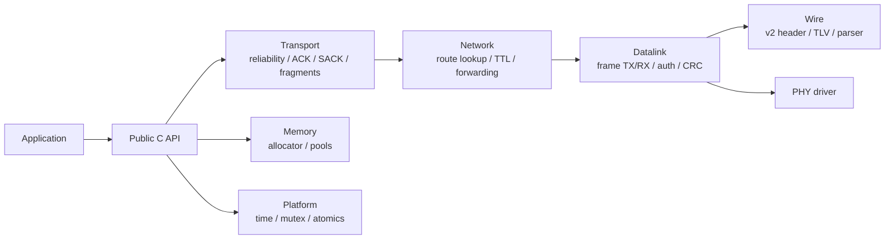

# xgen-link Protocol Stack

[](https://github.com/X-Gen-Lab/xgen-link/actions/workflows/ci.yml)
[](https://github.com/X-Gen-Lab/xgen-link/actions/workflows/pages.yml)

Production-oriented reliable multi-node protocol stack for resource-constrained MCUs.

English | [简体中文](#xgen-link-协议栈)

## Why xgen-link

xgen-link, also called XGL in the code and documentation, is built for embedded products that need reliable node-to-node communication without hiding protocol behavior behind a large runtime. It keeps the public SDK small, makes wire-format decisions explicit, and gives maintainers source-traceable documentation for protocol layers, validation gates, and release checks.

## Highlights

| Area | What it provides |
| --- | --- |
| Production wire format | v2 frame format with a 24-byte base header, TLV extensions, 16-bit node IDs, 32-bit packet numbers, and CRC validation. |
| Reliable delivery | Routed unicast, ACK ranges, SACK, RTT-based retransmission, connection-scoped peer state, ordered receive, and bounded retry policy. |
| Fragmentation | Large messages are carried with `FRAGMENT_EXT` and bounded reassembly state. |
| Security model | Optional authentication provider with AAD coverage over the protocol material documented in the security guide. Production presets require explicit auth configuration. |
| Embedded resource control | Config presets, allocator ownership, no-heap smoke validation, fixed memory pools, and resource budgeting for small MCU targets. |
| Low-power runtime | `xgl_next_deadline_ms()` exposes the next protocol deadline for bare-metal loops and RTOS sleep scheduling. |
| Maintainability gates | Unit/property/integration tests, SDK consumer smoke, no-heap smoke, footprint report, static analysis helper, Doxygen API generation, MkDocs strict build, and docs QA. |

## Architecture at a Glance



The installed SDK surface is limited to public headers under `include/xgl`. Internal wire, parser, routing, reliability, and fragmentation headers are documented for maintainers but are not stable public APIs.

## Capability Boundaries

- Single-frame payload length is constrained by the wire `uint16_t payload_len` field.
- Large messages use `FRAGMENT_EXT`; fragment sizing depends on route MTU, header size, TLV size, auth overhead, and CRC overhead.
- Compression and encryption flags are reserved codec capabilities and are rejected by the production path until fully implemented.
- Broadcast support is limited to documented address rules; reliable delivery is unicast-focused.
- Any design detail that is not confirmed from source is tracked in docs as `TODO(xgen-link): confirm ...`.

## Quick Build

```sh
cmake --preset gcc-test
cmake --build build/gcc-test --target xgl_tests
ctest --preset gcc-test --output-on-failure
```

## Release Validation

```sh
cmake --preset ci
cmake --build build/ci --target xgl_release_validation --parallel
```

The release validation target builds the library, tests, examples, SDK consumer smoke, no-heap smoke, static analysis helper, footprint report, and documentation when enabled by the `ci` preset.

## Documentation

- Documentation site source: [docs/](docs/)
- English docs: [docs/en/index.md](docs/en/index.md)
- Chinese docs: [docs/zh/index.md](docs/zh/index.md)
- Public API guide: [docs/en/reference/public-api.md](docs/en/reference/public-api.md)
- Protocol architecture: [docs/en/protocol/architecture.md](docs/en/protocol/architecture.md)
- Validation matrix: [docs/en/reference/validation-matrix.md](docs/en/reference/validation-matrix.md)
- Documentation build notes: [docs/README.md](docs/README.md)

Build the MkDocs site:

```sh
python -m pip install -r docs/requirements.txt
mkdocs build --strict
```

Build MkDocs plus generated Doxygen API through CMake:

```sh
cmake --preset ci
cmake --build build/ci --target xgl_docs
```

Run the documentation QA checks:

```sh
powershell -ExecutionPolicy Bypass -File ./tools/docs_qa.ps1
```

## Examples

| Example | Purpose |
| --- | --- |
| [Echo server](examples/echo_server/README.md) | Minimal send/receive flow and callback integration. |
| [File transfer](examples/file_transfer/README.md) | Reliable chunk transfer with ACK range/SACK terminology and production configuration examples. |
| [Multi-node](examples/multi_node/README.md) | Static route-table configuration and multi-node topology concepts. |
| [Platforms](examples/platforms/README.md) | Porting-oriented platform examples. |

## Requirements

- CMake 3.21+
- Ninja or another CMake generator
- C11 compiler for the library
- C++20 compiler for tests
- Python 3 with MkDocs dependencies for documentation
- Doxygen and Graphviz for generated API documentation
- cppcheck for release static analysis

## Project Map

| Path | Purpose |
| --- | --- |
| `include/xgl/` | Installed public SDK headers and internal maintainer headers. |
| `src/api/` | Instance lifecycle, configuration, send APIs, runtime, stats, and version entrypoints. |
| `src/wire/` | Wire serialization, TLV extensions, parser, CRC, frame authentication, and zero-copy framing. |
| `src/transport/` | Reliable delivery, ACK/SACK, windows, retransmission, ordered receive, and fragmentation. |
| `src/network/` | Route loading, lookup, mutation internals, forwarding, and network metadata. |
| `src/datalink/` | Frame boundary handling, datalink send/receive, and early validation. |
| `test/` | Unit, property, and integration tests for protocol behavior. |
| `examples/` | Buildable example applications. |
| `docs/` | Bilingual MkDocs source and Doxygen build integration. |

## Contributing

See [CONTRIBUTING.md](CONTRIBUTING.md). Documentation changes should keep Chinese and English pages structurally aligned and pass `mkdocs build --strict` plus `tools/docs_qa.ps1`.

## License

Copyright (c) 2026 X-Gen Lab.

---

# xgen-link 协议栈

[](https://github.com/X-Gen-Lab/xgen-link/actions/workflows/ci.yml)
[](https://github.com/X-Gen-Lab/xgen-link/actions/workflows/pages.yml)

面向资源受限 MCU 的生产级多节点可靠通信协议栈。

[English](#xgen-link-protocol-stack) | 简体中文

## 为什么选择 xgen-link

xgen-link 在代码和文档中也称为 XGL，目标是服务需要可靠节点通信的嵌入式产品。它不依赖庞大的运行时来隐藏协议行为，而是保持 public SDK 小而清晰、wire format 显式可追溯，并为协议层、验证门禁和发布检查提供与源码对应的维护文档。

## 核心特点

| 领域 | 能力 |
| --- | --- |
| 生产级 wire format | v2 帧格式，包含 24-byte 基础头、TLV 扩展、16-bit 节点 ID、32-bit packet number 和 CRC 校验。 |
| 可靠传输 | 路由单播、ACK range、SACK、基于 RTT 的重传、按 connection 隔离的 peer state、有序接收和有界重试策略。 |
| 分片重组 | 大消息通过 `FRAGMENT_EXT` 承载，并使用有界 reassembly 状态。 |
| 安全模型 | 可选 authentication provider；安全文档说明 AAD 覆盖的协议材料。生产预设要求显式配置认证能力。 |
| 嵌入式资源控制 | 配置预设、allocator 所有权、no-heap smoke 验证、固定内存池，以及面向小 MCU 的资源预算。 |
| 低功耗运行时 | `xgl_next_deadline_ms()` 暴露下一次协议 deadline，便于 bare-metal loop 和 RTOS sleep 调度。 |
| 可维护发布门禁 | 单元/性质/集成测试、SDK consumer smoke、no-heap smoke、footprint report、静态分析辅助目标、Doxygen API、MkDocs strict 构建和文档 QA。 |

## 技术架构概览


安装后的 SDK 面只包含 `include/xgl` 下的 public headers。wire、parser、routing、reliability、fragmentation 等 internal headers 面向维护者和测试文档化，但不是稳定 public API。

## 能力边界

- 单帧 payload 长度受 wire `uint16_t payload_len` 字段限制。
- 大消息使用 `FRAGMENT_EXT`；分片大小由 route MTU、header size、TLV size、auth overhead 和 CRC overhead 共同决定。
- compression 和 encryption 标志目前是保留 codec capability；生产路径在完整实现前会拒绝直接启用。
- broadcast 支持以文档化地址规则为准；当前可靠传输主路径聚焦单播。
- 源码无法确认的设计细节在文档中以 `TODO(xgen-link): confirm ...` 跟踪。

## 快速构建

```sh
cmake --preset gcc-test
cmake --build build/gcc-test --target xgl_tests
ctest --preset gcc-test --output-on-failure
```

## 发布验证

```sh
cmake --preset ci
cmake --build build/ci --target xgl_release_validation --parallel
```

`xgl_release_validation` 会在 `ci` preset 启用的能力范围内构建库、测试、示例、SDK consumer smoke、no-heap smoke、静态分析辅助目标、footprint report 和文档。

## 文档入口

- 文档站点源码：[docs/](docs/)
- 中文文档：[docs/zh/index.md](docs/zh/index.md)
- 英文文档：[docs/en/index.md](docs/en/index.md)
- Public API 指南：[docs/zh/reference/public-api.md](docs/zh/reference/public-api.md)
- 协议架构：[docs/zh/protocol/architecture.md](docs/zh/protocol/architecture.md)
- 验证矩阵：[docs/zh/reference/validation-matrix.md](docs/zh/reference/validation-matrix.md)
- 文档构建说明：[docs/README.md](docs/README.md)

构建 MkDocs 站点：

```sh
python -m pip install -r docs/requirements.txt
mkdocs build --strict
```

通过 CMake 构建 MkDocs 和 Doxygen API：

```sh
cmake --preset ci
cmake --build build/ci --target xgl_docs
```

运行文档 QA：

```sh
powershell -ExecutionPolicy Bypass -File ./tools/docs_qa.ps1
```

## 示例

| 示例 | 用途 |
| --- | --- |
| [Echo server](examples/echo_server/README.md) | 最小发送/接收流程和 callback 集成。 |
| [File transfer](examples/file_transfer/README.md) | 可靠分块传输，使用 ACK range/SACK 术语和生产配置示例。 |
| [Multi-node](examples/multi_node/README.md) | 静态 route table 配置和多节点拓扑概念。 |
| [Platforms](examples/platforms/README.md) | 面向移植的平台示例。 |

## 环境要求

- CMake 3.21+
- Ninja 或其他 CMake generator
- 用于库构建的 C11 compiler
- 用于测试的 C++20 compiler
- Python 3 和 MkDocs 文档依赖
- 用于生成 API 文档的 Doxygen 和 Graphviz
- 用于发布静态分析的 cppcheck

## 项目结构

| 路径 | 用途 |
| --- | --- |
| `include/xgl/` | 已安装的 public SDK headers 和 internal maintainer headers。 |
| `src/api/` | 实例生命周期、配置、发送 API、运行时、统计和版本入口。 |
| `src/wire/` | Wire 序列化、TLV 扩展、parser、CRC、frame authentication 和 zero-copy framing。 |
| `src/transport/` | 可靠传输、ACK/SACK、window、重传、有序接收和分片。 |
| `src/network/` | Route loading、lookup、内部 mutation、forwarding 和 network metadata。 |
| `src/datalink/` | Frame boundary、datalink send/receive 和早期校验。 |
| `test/` | 协议行为的单元、性质和集成测试。 |
| `examples/` | 可构建的示例应用。 |
| `docs/` | 双语 MkDocs 源码和 Doxygen 构建集成。 |

## 贡献

参见 [CONTRIBUTING.md](CONTRIBUTING.md)。文档变更需要保持中英文页面结构一致，并通过 `mkdocs build --strict` 和 `tools/docs_qa.ps1`。

## 许可证

Copyright (c) 2026 X-Gen Lab.
