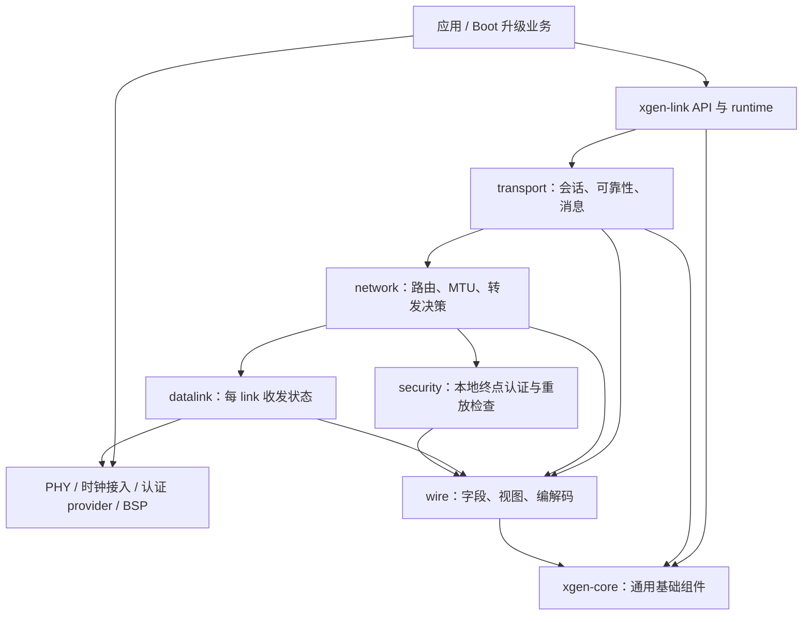

# xgen-link 双仓库与小容量 MCU 重构实施方案（历史设计）

状态：保留原始双仓设计及当时的实施目标，不作为现行依赖接入说明。后续已将通用能力拆为 status、bytes、CRC、memory、containers 五个独立包，core 活跃实现退休。本轮进一步将 link 收敛为只消费父工程 targets 或安装 package 的正式模块；独立源码开发由 [dev 装配入口](dev/README.md) 负责，不再由 link 的生产子模块或 `XGL_*_SOURCE_DIR` 选择版本。

现行边界以 [ADR 0001](design/adr/0001-core-dependency.md) 和[迁移指南](docs/zh/guide/modular-migration.md)为准，实际完成项、验证结果与剩余差距见 [REFACTORING_STATUS.md](REFACTORING_STATUS.md)。以下双仓拓扑、目录和阶段叙述均属于历史设计；保留它们用于追溯，不表示仍在实施 core 聚合交付，也不表示所有原目标已完成。

设计输入：协议跨平台使用；通用组件独立仓库；目标设备约 64 KiB Flash、8 KiB RAM，且需要放进更小的 Bootloader。Boot 分区大小、MCU 型号、Flash 擦写粒度和认证算法尚未确定，作为产品接入参数处理。

范围：先建立可验证的协议边界、资源模型和迁移路径，再逐步提取与替换实现。本文描述目标设计，具体 API、wire 兼容范围和生产源码的实现状态以进度记录和[迁移指南](docs/zh/guide/modular-migration.md)为准。

## 1. 总体决策

采用 **两个库仓库、一套协议状态机、按构建裁剪的三种配置**：

| 决策 | 实施约束 |
| --- | --- |
| `xgen-core` 提供通用机制 | 前缀 `xgc_`；不包含节点、路由、帧、会话、ACK 等协议概念 |
| `xgen-link` 提供协议 | 前缀 `xgl_`；保留 wire、datalink、network、transport、security，以及必要的 API/runtime |
| 应用负责平台装配 | BSP、PHY、Flash 驱动、主循环/RTOS 任务、认证 provider、工具链、链接脚本由应用接入 |
| Boot/Embedded/Full 共用实现 | 裁掉源文件、私有字段与资源容量；不复制一份 Boot 可靠传输协议 |
| 资源显式有界 | peer、link、TX、RX、重组都给出容量；容量不足返回背压或错误，禁止隐式扩容 |
| 单执行上下文 | 核心不创建任务、不睡眠、不加容器锁；多线程调用通过实例外部串行化 |
| 状态只有一个所有者 | peer 管理可靠会话，TX 槽管理在途数据，link 管理物理收发，security 管理安全会话 |
| 版本分别管理 | 公共 C API 版本、构建配置标识、wire 版本是三件事；不能以库版本升级掩盖 wire 语义变化 |

`error/list/hashtable/memory/crc` 放进同一个公共仓库的独立模块，先不拆成五个小仓库。Boot 链接它实际用到的模块即可。



图中的箭头表示使用关系。RX 控制流可以向上调用明确类型的交付接口，但下层不得包含上层私有结构。`wire` 是叶子模块，不反向依赖 datalink context。

## 2. 当前基线与优先处理的问题

此前已用 Arm GNU Toolchain 15.2.Rel1、Cortex-M0、`-Os` 编译当前 87 个 C 文件。全部对象编译成功，但没有链接完整 MCU 固件，也没有硬件运行结果。测量产物在本机忽略目录 `build/architecture-review/`；正式实施第一步要将可复现脚本和必要用例纳入版本控制。

| 项目 | 当前证据 | 对设计的影响 |
| --- | --- | --- |
| `struct xgl_instance` | ARM ABI 下 1528 B | runtime tiny 不能消除完整结构中未用到的字段 |
| datalink / replay 数组 | 616 B / 512 B，后者包含在前者中 | auth 关闭时也不能常驻完整 replay 表 |
| peer / reliable queue | 228 B / 148 B，queue 包含于 peer | Boot 不能沿用多 peer 的链表、索引和窗口分配 |
| tiny 初始化申请量 | 按 ARM 布局与申请路径核算约 4010 B，非板上实测 | 尚未含 peer、分配器额外填充/管理、驱动及栈，已占较大 RAM 预算 |
| 最大单函数栈 | transport send 616 B；若干 RX/TX 函数 568 B | 512 B 局部数组必须消失；单函数最大值不是任务栈峰值 |
| 全部对象 `.text + .rodata` | 26840 B | 只是未链接输入段之和，不能当作最终固件 Flash |
| no-heap 完整实例探针 | 自定义 allocator 下 create 成功、init 返回内存错误 | tiered pool 内部绕过实例 allocator，现有 smoke 不覆盖完整生命周期 |

4010 B 对应无配置 route、尚未创建 peer 的 tiny 初始化场景，来源为：实例 1528 + tiered 数据区 1664 + packet 槽 272 + route 数据区 320 + hash 桶 64 + RX 160 + 全局窗口标记 2。这里相加的是申请项，sizeof 已包含结构内部填充，尚未计算分配器额外对齐与管理开销；上表结构成员之间存在包含关系，不能重复相加。

已复现的行为问题必须先变成回归用例：

| 编号 | 现象 | 修正后的验收行为 |
| --- | --- | --- |
| B01 | 重传耗尽删除队列项，但窗口仍占用，下一次发送 `WINDOW_FULL` | 一次性终止消息并进入明确会话失败/恢复流程，资源可回收；不能伪造 ACK 跳过丢包 |
| B02 | 错误 connection/epoch 的 ACK 可退回仅 peer_id 查找并删包 | 精确 scope 不匹配时，队列、窗口、RTT、deadline 均不变化 |
| B03 | 只发送 0，ACK `[0,3]` 可把 base 推到 4 | ACK 全量校验先于状态修改；覆盖未来编号时整条拒绝 |
| B04 | send 传入 epoch=100，实际解码得到 epoch=0；session 又由 connection 低位推导 | DATA/ACK/CONTROL 的身份经过真实 wire 往返保持一致 |

其他静态审查问题纳入对应阶段：多 PHY 共用 parser、TLV 长度检查晚于访问、全局/peer 双窗口、ACK 早于接纳成功、分片数超过窗口无法持续推进、零拷贝包号固定、默认分配后未在生产 TX 使用的池，以及 API runtime 穿透协议内部状态。

现有测试曾通过 756 个 GoogleTest 测试用例及 4 项 CTest 检查。这是已有覆盖的基线，不能替代上述失败路径、真实双端通信及 MCU 资源验收。

## 3. 目标仓库与目录

建议最终目录如下。文件按职责归并，具体大小由可读性决定，不为每个几十行函数新建文件。

```text
xgen-core/
  include/xgc/
    status.h                 通用状态码
    allocator.h              带 ctx 的分配契约
    bytes.h                  对齐安全的字节读写
    list.h                   intrusive list
    hash.h                   不拥有 value 的有界索引
    pool.h                   调用方存储的固定块池
    crc.h                    已有 CRC 算法及增量接口
    clock.h / lock.h         可选服务契约
  src/
    status.c / bytes.c
    list.c / hash.c
    pool.c / tiered_pool.c / tracking_allocator.c
    crc8.c / crc16.c
  ports/
    libc/                    显式 malloc backend
    windows/                 可复用 OS 服务
    posix/                   按实际需求增加
    freertos/                按实际需求增加
  tests/ cmake/ examples/
  CMakeLists.txt

xgen-link/
  include/xgl/
    xgl.h                    入口与不透明 handle
    xgl_config.h             运行参数，非内部布局
    xgl_error.h               协议错误码
    xgl_link.h                PHY 接入契约
    xgl_security.h            provider 契约
  src/
    api/                     参数检查、生命周期、兼容入口
    runtime/                 有界调度、deadline 聚合
    wire/                    schema、frame view、编解码
    datalink/                link、stream parser、TX 提交
    network/                 route、MTU、转发
    transport/               peer、TX/RX、ACK、消息
    security/                AAD、认证、replay、epoch 策略
    internal/                少量跨层值类型、资源布局
  compat/                    过渡期旧 API 适配，可选
  profiles/                  boot / embedded / full
  tests/ examples/ cmake/ tools/ docs/
```

`api/runtime/wire` 都是协议实现所需部分，不因“只保留协议”而强行塞进四个目录。若项目要求四个主目录，可以把 wire 放到 `datalink/wire`，其依赖仍保持独立。

第一版不建立通用任务调度框架、插件注册总线、通用对象系统或统一虚拟层。层间函数调用使用明确的 C 类型；仅硬件/provider/应用回调需要函数指针。

## 4. 公共代码提取清单

| 当前来源 | 公共仓库内容 | 协议仓库保留内容 | 迁移方式 |
| --- | --- | --- | --- |
| `src/core/xgl_error.c`、`xgl_error.h` | 通用参数、容量、状态、超时类错误 | route/frame/CRC/ACK/window 等协议错误及旧码值 | 定义显式映射；不整体改名前缀 |
| `src/core/xgl_list.c` | intrusive list、迭代辅助 | 协议对象及释放逻辑 | 原算法迁移，先用兼容包装维持调用点 |
| `src/core/xgl_list_ts.c` | 可选同步容器包装，确有消费者时提供 | 实例级协议串行化 | Boot 不构建；不能用链表锁宣称协议线程安全 |
| `src/core/xgl_hashtable.c` | caller-owned buckets/nodes 的泛型索引 | `uint16_t` 路由键、route value、路由错误语义 | 移除 `xgl_route_item_t*` 耦合和逐项分配 |
| `src/memory/xgl_allocator.c` | ctx allocator、显式 libc backend | API 兼容 adapter | 移除识别 tracker 函数地址的特殊分支 |
| `xgl_mempool*`、`xgl_tiered_pool*` | 固定块管理、可选多档池与统计 | 协议容量规划 | 外部提供存储；不默认强建三档池 |
| `xgl_tracking_allocator.c` | 通用计数、峰值、分配来源装饰器 | INIT/TX/RX/RELIABLE/FRAGMENT 阶段标签 | 通用 tracker 不引用协议阶段枚举 |
| `xgl_packet_pool.c`、内部 packet 类型 | 仅底层固定槽机制 | packet、payload 所有权、PHY、会话、重传元数据 | 协议资源层调用公共 pool；不把 packet 整体搬走 |
| `src/wire/xgl_crc.c` | 已有 CRC8/CRC16 算法、分段更新 | CRC 覆盖范围、header/frame 规则 | golden vectors 验证位级等价 |
| `src/wire/xgl_serialize.c` | 通用整数 endian 读写 | wire offset、字段宽度、TLV schema | 字节访问算法迁移，协议边界校验仍在 wire |
| `src/platform/*` | 可复用 clock/lock/atomic 接口及 backend | deadline、重传时机、PHY 接口 | 协议核心不再调用全局 OS 时间和 sleep |
| `src/codec/xgl_codec.c` | 只有已有独立算法确有复用价值时迁移 | 编码协商、wire 标志、协议策略 | Boot 裁掉；现有未闭合 codec 链路保持禁用 |

公共仓库验收：独立 C 工程构建、测试和安装；无 `xgl/` include、`XGL_` 配置依赖及协议类型；只使用 list 或 CRC 的消费者不被迫链接 allocator、线程库和 OS port。

### 4.1 error 的边界

公共组件返回 `xgc_status_t`，建议首批只包含 `OK / INVALID_ARGUMENT / NO_MEMORY / CAPACITY / NOT_FOUND / BUSY / UNSUPPORTED` 等实际使用值。协议仍返回 `xgl_error_t`。

映射必须带业务位置：hash 的 `NOT_FOUND` 在路由查询处可以成为 `XGL_ERR_ROUTE_NOT_FOUND`，在普通对象查询处不应该成为路由错误。pool 满映射为容量/忙，真实申请失败才映射为内存错误。

错误码与错误字符串拆开编译。Boot 保留数值和必要错误事件，默认不链接完整字符串、格式化日志。不要把公共与协议枚举直接强制转换；不要为保持外观统一而把全部错误放进一个全局大枚举。

### 4.2 allocator / pool 的契约

以下是拟议接口形状，不是当前 SDK 可编译示例：

```c
typedef struct {
    void *ctx;
    void *(*alloc)(void *ctx, size_t size);
    void (*free)(void *ctx, void *ptr);
} xgc_allocator_t;
```

约束：

- 普通分配满足 `max_align_t`；DMA 等特殊对齐存储由显式接口/驱动提供，不能暗示普通 alloc 已保证。
- `alloc(0)` 返回 NULL；`free(NULL)` 无操作；同一块由同一 allocator 释放；ctx 生命周期覆盖全部分配。
- NULL allocator 表示没有该服务，不能隐式回落到 malloc。libc backend 必须显式选择。
- pool 初始化接收 storage、storage_size、block_size、alignment、count，检查乘法/加法溢出、对齐与容量。
- pool 不负责协议对象析构；hash/list 不负责释放业务 value；调用方决定生命周期。
- tiered pool 的档位由配置提供，不强制给最小设备分配一个 1024 B 大块。
- tracker 只包装另一个 allocator，正常传递 ctx；调试功能不进入 Boot 必选依赖。

hash 初版采用调用方提供 bucket 和 intrusive node 的固定容量实现，插入不申请内存、不自动扩容。可以先提供当前真正需要的整数键索引，移除 route value 耦合，不必立即增加任意键序列化、自动扩容和复杂回调。Boot 单路由直接匹配，小规模 Embedded 可用线性数组；只有实际需要时才链接 hash。

## 5. 协议模块与状态所有权

| 状态 | 唯一所有者 | 其他模块访问方式 |
| --- | --- | --- |
| 实例配置、资源布局、关闭状态 | API/runtime | 只读配置或明确生命周期操作 |
| parser、RX bytes、轮询时间、PHY pending TX | 每个 `link` | datalink 的输入/提交/完成接口 |
| 路由条目、路由选择 | network | 返回 route view / link id / MTU |
| connection、可靠 TX/RX 序号、会话失败状态 | transport peer | submit/receive/reset 操作 |
| 发送载荷、已编码帧、重试次数、发送时间 | TX slot | 唯一状态转换函数 |
| TX window、ACK 标记、可选索引 | peer TX | 同一状态的索引/表示，不各自释放数据 |
| RX 乱序槽、接纳进度 | peer RX | accept/drain 操作 |
| 大消息发送偏移、重组块 | 可选 message 模块 | transport 交付与推进接口 |
| 认证 provider、replay、可信 epoch | security session | check/classify/commit/close 操作 |

删除 transport context 上重复的全局 window、reliable queue、RTT。容量查询必须调用和发送准入相同的逻辑，同时考虑目标 peer 窗口、全局 TX 槽和目标 link 能力。

runtime 不遍历 peer 链表或 fragment 内部节点，只聚合各模块提供的 deadline。不要为减少文件数量而把所有模块重新合成大文件；优先合并同一状态的操作。

transport 建议归并为 `transport.c / peer.c / tx.c / rx.c / ack.c / runtime.c`，可选 `message.c / fragment.c / reassembly.c`。RTT 和窗口算法可保留独立可测试单元，但不维护第二份权威状态。

## 6. 统一内存模型

### 6.1 同一状态机使用两种初始化入口

建议新 API：

```c
/* 草案：相关类型在实施阶段完整定义。 */
xgl_error_t xgl_memory_requirements(const xgl_config_t *cfg,
                                  xgl_memory_requirements_t *out);
xgl_error_t xgl_init_static(void *storage, size_t storage_size,
                           const xgl_config_t *cfg, xgl_handle_t *out);
xgl_error_t xgl_create_with_allocator(const xgl_config_t *cfg,
                                     const xgc_allocator_t *allocator,
                                     xgl_handle_t *out);
xgl_error_t xgl_deinit(xgl_handle_t handle);
```

`requirements` 至少返回总字节数、对齐、配置标识。`init_static` 在一个 workspace 内切分实例、link、peer、槽及缓冲区；allocator 入口只在初始化时取得同样的 workspace，再调用同一内部初始化函数。

所有 profile 的协议运行期均使用已预留容量。完整版需要更大的容量时，通过重新配置/创建实例处理，不让某个错误路径偷偷启用无界 heap。

生命周期规则：

1. 先校验配置和全部容量，再计算布局；使用检查过的加法、乘法和 alignment round-up。
2. 初始化失败时 `*out = NULL`，不留下活动 PHY 提交；allocator 入口释放本次已取得的存储。
3. static workspace 由调用方持有且禁止运行中移动；普通配置值复制进入实例。
4. 外部 PHY/provider/user ctx 是借用对象，必须存活到 deinit 完成。可变路由复制进有界 route 存储；显式只读路由表允许长期放在 Flash，但要声明借用生命周期。
5. 内部区分 caller-owned 与 allocator-owned workspace；deinit 不 free 调用方数组。
6. reset 不释放外部存储，也不能提前复用 DMA 仍在引用的 TX 槽。
7. 异步 PHY 未完成取消/排空时 deinit 返回 BUSY；调用方先完成 drain/cancel，再结束生命周期。

固定 Boot 构建提供由该目标布局产生的 workspace 大小/对齐常量，支持静态数组声明。交叉构建不能靠“运行目标程序打印 sizeof”；尺寸从目标布局/编译检查获得，初始化再校验版本与容量。动态查询接口用于检查配置，不依赖 VLA。

### 6.2 必须独立限制的容量

至少包括：`max_links`、`max_routes`、`max_peers`、全局 TX 槽数、每 peer 窗口、每 link RX 帧容量、全局乱序槽数、待发送消息数、重组消息数、单消息字节上限、重组总字节上限、security session 数。

新容量字段中 0 表示禁用/无容量，不再混用“0=默认值/无限制/无超时”。默认值由显式 preset 初始化。超时是否关闭使用独立标志或单独明确契约。

内存估算按以下项目计算，每项包含实际对齐：

```text
workspace = instance + links + peers + routes
          + TX slots/bytes + RX frame slots/bytes + control bytes
          + optional OOO + optional message/reassembly
          + optional security state + optional diagnostics
```

表中不能同时把整个 peer 与其内嵌 queue 重复计费。应用 Flash 写入缓存、驱动 DMA/ring、密码算法上下文、任务/中断栈另列，再计算全系统峰值。

### 6.3 Boot 起始资源配置

| 项目 | 起始值 | 说明 |
| --- | ---: | --- |
| links / routes / peers | 1 / 1 / 1 | 静态直接匹配，不需要 hash |
| 最大完整帧 | 128 B | 含 header、TLV、tag、CRC；不等于应用 payload |
| DATA TX 槽 / 每 peer window | 1 / 1 | 停等可靠传输 |
| RX 完整帧存储 | 1 × 128 B | 输入半帧与已完成视图有明确生命周期 |
| control 输出存储 | 1 × 128 B | DATA 等 ACK 时仍能回复 ACK/RESET |
| OOO / 通用重组 / 待分片消息 | 0 / 0 / 0 | 收到不支持功能时拒绝，不部分交付 |
| route forwarding / codec | 关闭 | 按源文件与字段裁剪 |
| 日志字符串 / 全量统计 / 内部锁 | 关闭 | 可选少量计数器单独预算 |
| authentication | 产品明确选择 | 不能以 Boot 为由默认降低既定安全要求 |

TX 数据帧、RX 帧、control 帧至少可能同时存在，起始方案不让它们共享同一块 128 B 缓冲。Boot TX 可以保留已经编码的完整帧作为重传存储，减少重复 payload 副本；只有驱动完成且可靠持有结束后才能复用。

认证 ACK 使用 24 B 头 + 14 B SESSION + 15 B SECURITY + 15 B 单范围 ACK + 16 B tag + 2 B CRC，共 86 B（未含 PHY 外层封装）。tag 最大长度与其他扩展也必须进入实际 MTU 计算，不能继续依赖“ACK 只需 32 B”的旧假设。

无分片认证 DATA 若使用上述 SESSION/SECURITY、3 B DATA_TYPE 和 16 B tag，128 B 中剩余 54 B payload；Boot 命令字段还要从这 54 B 中扣除。最终块长由统一 layout 函数计算，不能在升级程序硬编码为 128。

## 7. 类型化数据路径与 wire

用明确的只读 view 替代所有层都接收 `void *data` 的接口。建议内部区分：

| 类型 | 含义 | 生命周期 |
| --- | --- | --- |
| `xgl_frame_view_t` | 长度、TLV、CRC 已验证的序列化帧及字段切片 | 当前处理调用期间；不暗示已认证 |
| `xgl_packet_view_t` | 本地传输所需的身份、包类型、payload、扩展 | 同上；已通过该配置要求的安全策略 |
| `xgl_tx_plan_t` | 身份、长度、扩展和认证开销已经确定的发送计划 | 当前构建/提交期间 |
| `xgl_owned_tx_slot_t` | 跨调用保存的数据与发送状态 | 直到协议持有和驱动持有均结束 |

wire 提供唯一完整帧解码入口，先保证 `header_len` 在实际缓冲区内，再扫描 TLV，随后校验 payload/tag/CRC 边界。检查溢出时使用 `needed <= capacity - offset` 等形式，不依赖可能溢出的总和。

所有入口，包括直接 frame API，都经过该验证器。stream parser 为确定帧长可读最小基础头；完整帧形成后不要让 datalink 和 network 再各自完整解码一次。

重复 SESSION/SECURITY/DATA_TYPE 等单值扩展统一拒绝；未知扩展遵循确定的版本规则。若需要改变当前重复/未知扩展行为，先加入兼容样例和文档，不默默改变解析规则。ACK 范围保存为有界切片，校验和应用各遍历一次，避免 `ranges[64]` 栈数组。

编码器只写调用方输出，不申请内存、不修改 peer。失败时输出长度为 0、字节内容不保证；禁止提交失败的半帧。普通发送、control、重传和零拷贝共用长度计算、身份构造和认证入口。

零拷贝作为后期可选 API：显式取得 TX lease，调用方填写 payload，再 commit/cancel。使用 `{slot, generation}` 防止过期 token 操作新对象。Boot 首版复制几十字节即可，不为零拷贝引入引用计数树和复杂释放回调。

## 8. link、PHY 与异步完成

route 指向 `link_id`，一个唯一 PHY 对应一个 link。每个 link 独立保存 parser、RX 缓冲、轮询 deadline 和发送状态。多个 route 指向同一 link 时每轮只读一次；两个 PHY 的半帧不可交叉进入同一 parser。

先落地同步消费 PHY 契约：`tx` 返回后不得再引用传入指针。驱动若启动 DMA，应先复制到其自己的固定缓存，或使用后续异步接口。当前“accepted”未说明是否保留指针，迁移文档必须写清。

可选异步接口显式提交 lease，驱动报告带 `{slot, generation, submission_id}` 的完成/失败事件。generation 标识槽生命周期，submission_id 每次 PHY 提交更新，用于区分同槽的多次重传。完成事件必须匹配当前提交且幂等处理，避免前一次提交的迟到/重复事件清除后一次的驱动持有。ISR 只记录事件，主循环处理协议状态。BUSY/提交失败不转移所有权；驱动一旦接受，协议不得覆盖其数据。

TX 槽必须分别记录两个事实：

- `driver_pending`：驱动仍可能读取存储。
- `protocol_pending`：仍需等待 ACK、重传或完成业务发送责任。

ACK 可能先于驱动完成回调被处理，驱动完成也可能先于 ACK。只有两者都清除才允许 FREE。reset/cancel 要确认硬件不再访问，再释放；过期完成事件不得释放新 generation 的槽。

control 有独立存储与待发送标记。驱动忙时保留 ACK 意图，在后续 step 优先发送；Boot 单 peer 可合并重复 ACK 请求，无需无限 control 队列。

## 9. 可靠传输的实现契约

### 9.1 peer 身份与 TX 准入

核心 peer key 固定为 `{remote_id, connection_id, session_epoch}`。多逻辑网络使用独立实例；不临时用 ingress link 代替端到端连接身份。默认连接归一化只在 API/兼容入口发生一次，不能在 ACK miss 时退回任意同节点连接。

`session_id` 的旧短字段不再成为另一套内部权威身份。SESSION_EXT 实际编码 epoch，解析后同样用于 DATA、ACK、CONTROL、重组和 security。`incarnation_id` 当前语义未闭合，先明确保留规则；升级为身份的一部分必须同步所有层和 wire 规范。

新 `submit` 返回成功表示协议已接管发送责任，返回前必须取得 TX/消息容量并落实数据所有权。失败时不发出部分消息、不消耗可靠顺序编号、不残留半个消息对象。

新语义通过明确的新入口/公共 API 大版本交付。旧 `xgl_send()` 的兼容行为单独规定，不能只换函数内部实现就悄悄把“已提交 PHY”改成“排队等待”。

### 9.2 ACK 原子应用

ACK 处理顺序为：身份与会话检查 → 全部范围合法性检查 → 判断实际已发送集合 → 采样可用 RTT → 统一完成 TX → 推进窗口并更新 deadline。

未来编号、非法范围、算术溢出导致整条 ACK 无状态效果。已确认编号的重复 ACK 幂等忽略；不能把它误判为跨会话 ACK。RTT 在释放槽之前提取，仅使用无重传歧义的样本；关闭自适应 RTT 的 Boot 可以固定 RTO。

所有首次发送、超时重传、SACK 快速重传经过同一 TX 操作，共用 retry 上限、错误统计和失败回收。删除 `xgl_reliable_process_timeouts()` 直接把 payload 送 PHY 的第二条重传路径。

### 9.3 RX 接纳与 ACK 时点

新增能表达背压的应用接纳契约 `ACCEPTED / BUSY / REJECTED`。ACCEPTED 表示应用已经同步消费或复制到稳定存储；借用 RX 指针不能在回调返回后继续保存。

处理期内禁止回调重入同一实例的协议操作；应用在 step 返回后发送响应。旧 void RX callback 用“返回即已消费”的适配方式接入，需要异步持有数据的旧应用必须迁移。

| RX 情况 | 状态变化与响应 |
| --- | --- |
| 正好是期望编号，接纳成功 | 推进接收状态，记录 ACK 意图，应用交付一次 |
| 正好是期望编号，应用 BUSY/资源不足 | 不推进、不确认，允许稍后重传重新接纳 |
| 已经接纳的重复 reliable DATA | 不再次交付，重新生成 ACK |
| Boot 收到未来编号 | 不缓存、不确认该包，等待缺失编号；可回复已确认进度 |
| Full 收到未来编号 | 取得有界 OOO 槽后才能确认已保存的数据 |
| 消息/分片明确不支持或不可恢复拒绝 | 返回错误并按定义失败会话/消息，不能当成功 ACK |

security 的“已见过认证包”不等于 transport 的“已接纳数据”。重复可靠包允许进入 transport 做上述判断，避免第一次因应用 BUSY 丢弃后，重传永远被 replay 层挡住。

已经 ACK 的 OOO 槽由接收端承担交付责任。排空时应用 BUSY，必须保留槽及接纳状态；应用容量恢复后再次驱动 step 交付，不能依赖发送端重传。BUSY 本身不强制产生立即 timeout，避免空转。对已 ACK 的分片同样不能静默超时丢弃；无法继续完成时进入可观测的消息/会话失败流程。

### 9.4 耗尽、失败与恢复

重试耗尽：peer 进入 FAILED，相关消息终止一次，释放协议持有，等待驱动持有结束再回收存储。可立即报告失败事件，但允许调用方释放借用源的最终完成通知必须等待所有引用结束。不能把失败包标成已确认并继续递增，因为对端仍等待缺失编号。

恢复使用双方明确建立的新连接/epoch。旧 ACK、旧完成事件和旧分片不得作用于新会话。包号耗尽前停止准入并换会话，不允许静默回绕。收到陌生更大 epoch 不能自动信任并替换当前会话。

### 9.5 Full 的消息推进器

消息对象保存 `{message_id, total_len, next_offset, source_owner, completion_token}`。有 TX 槽就产生后续片；窗口满时保留偏移，ACK 释放容量后继续。window=1 也应能发送多片消息。

消息来源可采用有界复制存储或显式 borrow-until-complete 契约，调用者明确选择。所有片确认且全部协议/驱动引用结束后，才发出允许释放借用源的最终完成通知；任一不可恢复失败触发一次失败结果，缓冲释放仍遵守引用结束规则。复制模式的调用方源数据在成功复制后即可释放，不能混用两种生命周期。取消已经部分发送的消息要定义对端残留片的超时/清理规则。

逐片 ACK 完成表示对端承担了各片的接收责任，不等于对端应用已经处理了完整消息。需要后者时使用明确的应用消息完成响应；重组超时/失败应可观测，不能静默清理已确认数据后继续报告消息处理成功。

接收重组同时限制消息数、单消息字节数、总字节数和超时。Boot 不编译该模块，固件块传输由应用协议处理。

## 10. security 与 wire 兼容的必要决策

### 10.1 把数据顺序号与安全序号分开

当前代码中，可靠接收要求连续 DATA packet number；ACK 又复用被确认 DATA 的 header packet number；replay 直接使用 header packet number，未区分两种用途。不能简单给所有帧统一递增 header packet number，这会让丢失的 ACK/CONTROL 在 DATA 排序中制造永远补不上的空洞。

本方案的目标选择：

| 序号 | 所有者 | 用途 |
| --- | --- | --- |
| `data_seq`，使用可靠 DATA 的 header packet number | transport peer | 可靠 DATA/fragment 连续顺序，ACK_RANGE/SACK 引用此域 |
| `security_seq`，使用 SECURITY_EXT 的 `nonce_id` | security association | 所有认证帧的防重放序号，不要求连续到达 |

ACK、CONTROL、非可靠 DATA 不消耗可靠 DATA 序号。所有认证发送路径，包括零拷贝与重传，都经过同一个安全序号分配器。

新语义中这三类帧的 header packet number 统一写 0，接收方不把它送入可靠排序；被确认的编号只来自 ACK_RANGE/SACK。旧 v2 字段解释限制在兼容入口。CONTROL 的重复操作还需请求标识/状态前提保证幂等，不能因一次重试获得新 security_seq 就再次执行不适用的 RESET。

安全序号在构建新的认证发送尝试时消耗，失败也不回滚。可靠重传保持 data_seq，分配新的 security_seq 并重新生成 tag；ACK 重生成同样使用新的 security_seq。这样即使其他帧已推进 replay 窗口，旧 DATA 仍能通过一次新的认证重传完成可靠交付。

Boot 的 TX 槽可以继续保留完整帧，但重传前需在驱动不再持有时更新安全序号/tag/CRC。不能在 DMA 读取期间原地重签。完整 payload 不变，transport 依然按 data_seq 判重。

例如 DATA(0,100)、ACK(-,101)、CONTROL(-,102)、DATA(1,103) 中后两个字段表示 `(data_seq, security_seq)`。即使 ACK/CONTROL 丢失，DATA 1 仍紧随 DATA 0；安全窗口也不等待 101、102。

安全关联绑定通信方向、端点、connection/epoch 与 key。provider 的 nonce 使用必须满足其算法要求；仅把不同方向放进 AAD，不能代替需要唯一 nonce 的算法约束。重启后必须使用可信的新关联/epoch、适当的密钥分离或持久化计数器，不能清空 RAM 后在同一安全关联中重新从 0 开始。

provider 新契约显式传入版本化的认证输入描述，其中包含 security_seq、安全关联上下文和 canonical AAD/payload 视图；这些身份必须与实际被认证的字节一致。现有只接受 key_id/AAD/payload 的 provider 通过明确 adapter 迁移，不能继续从 header packet number 推导 nonce。具体 nonce 映射、tag 长度、sign/verify 输入输出向量在 P00/P09 固定；协议不自行选择或实现密码算法。

### 10.2 兼容边界必须如实标记

SECURITY_EXT 已有 64 位 nonce_id，现实现把它写成 header packet number，并在接收解析后忽略。复用这个字段不增加扩展长度，但改变 replay 语义，旧 v2 认证端无法自动正确互通。

实施采用以下发布策略：

1. 提取公共组件、静态资源、typed view 等结构重构保留当前 v2 字节级 fixtures。
2. 独立安全序号作为单独协议语义变更交付，推荐使用新的 wire 版本；确切版本值与规范在 P00 固定。
3. 如产品必须继续使用 version=2，必须在会话建立前显式选择双方一致的认证模式，并绑定认证上下文。不能把它宣传成所有旧 v2 自动兼容。
4. 旧 v2 支持放入显式兼容构建/入口；禁止验签或 replay 失败后自动尝试旧语义。
5. Boot 与 Full 在同一部署中使用相同协议版本和安全模式。当前 HANDSHAKE 是保留能力，首版通过产品配置匹配 MTU、窗口和能力，不假设已有协商。

因此，“公共库提取不改变 wire”和“安全状态机修复可能需要 wire 语义升级”分别立项、分别验收。不能用目录重构的兼容承诺遮盖后者。

### 10.3 本地认证与转发

目标沿用现有文档声明的端到端认证模型：

```text
link 收到完整帧 → wire 边界/CRC 检查 → network 判定目的地
  本地：security 验证与重放分类 → transport → 应用
  转发：TTL/route/MTU/容量检查 → 复制到输出槽 → 改 TTL/CRC → link TX
```

转发节点不需要持有端到端密钥，不重签、不改 tag。配置要求认证或帧声明认证时，验证成功前不得本地交付；明确允许未认证流量的配置按其策略处理。若产品要求仅转发已验证链路身份的流量，需要另配逐跳认证策略，不能复用端到端 tag 伪装为逐跳保护。

目前 datalink 在目的地判断前验签，与“无源端密钥也能转发”的文档目标有差异；迁移需要专门的中继测试。认证策略改变独立提交，不混入纯 parser 提取。

AUTH 被编译关闭时，本地收到声明认证的帧应拒绝，不能当普通帧接收。配置要求 AUTH 而 provider 缺失时初始化失败。CRC 仅作误码检测，不代替认证。

### 10.4 replay 容量与会话结束

replay 状态按有界的安全关联存储，Boot 只保留需要的活跃方向和关联。容量满时拒绝新关联，或由明确关闭/替换流程回收；不能 LRU 删除窗口后无条件重建并接受旧会话。

可信 epoch 的来源与准入由安全会话策略决定。peer 超时可以释放传输缓存，但不等于可以重新信任旧 epoch；长期防重放所需的持久化/握手由产品安全方案提供并单独计费。

安全关联通过显式 session-install/open 入口安装已经获得信任的参数，普通数据帧不能隐式创建更高可信 epoch。P00 必须为首个产品选定一种可运行方式：双方预配置且防回退的会话参数、持久化计数器与对应的可信对端准入，或单独实现受认证会话建立。首次接入、重启、关闭重连和容量替换均写入支持矩阵。只有固定 key、没有新鲜性来源/持久化状态/建立流程的配置，不能标为支持重启后的防重放；这个条件是认证版发布门槛。

AAD 生成与 provider 调用集中在 security；wire 只提供字段布局和规范化所需视图。先用显式有界 scratch 替代两个 255 B 栈数组；后续 provider 若支持分段输入，再按 canonical 片段更新，禁止为省缓冲改动认证字节含义。

## 11. 多平台 runtime 与时间模型

建议新增核心入口：

```c
/* 草案接口，budget 对 RX 字节、帧与 TX/重传工作量分别设上限。 */
xgl_error_t xgl_step(xgl_handle_t handle, uint32_t now_ms,
                     const xgl_work_budget_t *budget);
bool xgl_next_timeout(xgl_handle_t handle, uint32_t now_ms,
                      uint32_t *delay_ms);
```

核心不读取全局时间。同一轮 step 的各层共享 now_ms；有需要的发送入口也接收 now_ms 或使用统一实例入口采样。旧 `xgl_run()` 通过实例 clock adapter 获取时间再调用核心。

timeout 返回“是否存在 + 相对延迟”，不用时间值 0 表示未启动，也不把合法绝对时刻和无 deadline 哨兵混在一起。32 位时钟比较规定最大时间跨度小于半个计数周期，并覆盖从 0 开始与回绕测试。

每轮顺序建议：处理驱动完成 → 优先已排队控制帧 → 按预算接收 → 处理重传/失败与消息推进 → 聚合下一期限。不能让持续 RX 饿死 ACK 和重传；也不能把“最大 RX 字节数”传到“超时毫秒”参数。

Boot 仅扫描单 link/peer/槽；Full 初版也采用有界数组扫描，先不引入定时器堆。slot/peer 上的 deadline 是派生缓存，更新必须由状态转换统一维护，或小容量模式直接计算。

| 平台 | 集成方式 |
| --- | --- |
| 裸机 MCU | 主循环调用 step；ISR 管理驱动 ring/DMA 事件；应用依据 timeout 休眠/喂狗 |
| RTOS | 一个协议任务串行执行；其他任务通过有界队列提交命令；唤醒源为 RX/TX 完成/timeout |
| Linux / Windows | 事件循环或单线程执行器驱动同一核心；OS port 不被协议自动选择 |
| 多线程直接 API 包装 | 可选实例串行化适配；明确回调不能重入；容器本身不各加一把锁 |

ISR 共享状态使用平台适当的原子操作、临界区或驱动同步；`volatile` 本身不能保证原子性与内存顺序。不支持的线程/atomic backend 应构建失败或显式返回不支持，不能用 noop 冒充安全实现。

第一批验证 Cortex-M0、一个实际目标 MCU 和主机 ABI。端序通过字节读写隔离；禁止未对齐整数指针强转、packed C 结构直接作为 wire。8/16 位 MCU 需要额外验证 size_t、移位与地址空间，不能仅凭使用 C11 宣称已覆盖。

## 12. 构建、profile 与版本

### 12.1 编译 profile 是功能上限

| 能力 | Boot | Embedded | Full |
| --- | --- | --- | --- |
| 最小可靠传输 | 保留，窗口 1 | 可配置有界窗口 | 可配置有界窗口 |
| 多 link / 多 peer | 首版各 1 | 按容量开启 | 按容量开启 |
| OOO / SACK 复杂路径 | 关闭；支持必要单范围 ACK | 可选 | 可选 |
| 通用分片与重组 | 关闭 | 可选 | 可选 |
| 路由转发 | 关闭 | 可选 | 可选 |
| 认证/replay | 产品明确启用或拒绝 | 按安全模式 | 按安全模式 |
| codec | 关闭 | 首轮仍关闭 | 完整闭合并测试后再启用 |
| 统计/日志/错误字符串 | 关闭或最小计数 | 可选 | 可选 |
| 运行期扩容 | 禁止 | 禁止 | 禁止；初始化容量可以更大 |

配置入口为 `XGL_PROFILE=boot|embedded|full`，再允许经过验证的有限覆盖。运行时参数只能在已编译能力和容量内缩小，不能打开缺失代码。用户请求不支持能力时给出明确错误。

生成唯一的 `xgl_build_config.h`，CMake 和 Kconfig 通过明确适配生成同一份配置。功能关闭同时移除源文件、私有字段和 workspace 分区，而不是仅在 if 分支里跳过执行。

不使用 feature 宏改变同名公共结构的字段布局。handle 保持 opaque；公共配置/provider 带版本或结构大小检查；生成配置与库必须匹配。Boot/Full 各用独立构建目录和安装前缀，第一版不支持同一进程链接两种 profile 的同名库。

调用侧配置包含 `abi_version / struct_size / build_config_id`，由安装头中的初始化宏或内联 helper 使用调用侧常量填写；库入口与自身编译常量比较。不能仅由库返回自己的标识再比较自己。门禁实际组合 Boot 头与 Full 库、旧结构大小与新库，要求在读取后续字段和分配存储前拒绝。

### 12.2 target 与依赖交付

建议 `xgc::base / memory / containers / bytes / crc`，可选 `libc_allocator / port_windows / port_posix / port_freertos`，协议统一入口 `xgl::xgl`。公共模块内部按函数职责分源，避免因一个初始化函数引用所有可选模块而阻止裁剪。

库项目仅启用 C；测试启用时再启用 C++20。使用 target 级 include、compile feature、定义与选项；移除全局 `include_directories()`。

若公开 API 出现 `xgc_allocator_t` 等类型，定义它的 `xgc::base` 是 PUBLIC 依赖；实际容器、CRC 是 PRIVATE 实现依赖。静态库的 PRIVATE 依赖不会自动合并进 `libxgl.a`，安装包仍通过 `find_dependency(xgen_core ...)` 找到需要的 targets。

消费方式只选一条：上层已提供 xgc targets → 显式本地源码路径 → 已安装包。优先级写入 CMake 文档，禁止同时加载两份。依赖缺失明确报错，默认不通过 FetchContent 隐式联网。

`xgc::base` 通过约定 target 属性/配置函数暴露版本与能力。三种消费方式都校验支持范围及所需 targets；源码路径不能跳过版本检查，缺失版本信息也不能默认兼容。安装方式另用 package version 与 `find_dependency` 校验，并测试上层提前提供不兼容 core target 时配置失败。

开发装配可由上层工程 `add_subdirectory(xgen-core)` 后 `add_subdirectory(xgen-link)`；应用锁定两个仓库的完整提交，协议包声明测试过的 core 版本范围。首次提取可在本地 sibling checkout 实施，不把公共库代码再复制回协议 src。

### 12.3 API 迁移策略

allocator 回调签名、PHY 生命周期、接纳回调和 submit 语义都涉及公共 API，建议集中形成一次 SDK 主版本升级，而不是多个小版本偷偷破坏 ABI。

提供可选 `xgl_compat_v2`：保留旧入口/错误码值，用普通 adapter 转发。旧 allocator 的 callback 无 ctx，由 adapter 持有旧描述结构并调用原回调；不再用函数指针身份识别特殊 tracker。

内部头迁入 src，默认不安装；少数 wire 工具如确有外部消费者，明确建立独立的可选接口及版本承诺。兼容层只做映射，不复制可靠状态机。Boot 默认不链接兼容层。

库 API 主版本和第 10 节的 wire 语义版本独立记录，分别声明支持矩阵。所有旧新端组合必须有明确结果：受支持、受限兼容、初始化拒绝或协议拒绝。

## 13. Boot 应用协议与资源目标

若 Boot 用于升级，应用提供 `BEGIN / WRITE / QUERY / VERIFY / COMMIT` 一类块命令。消息包含 image 标识、offset、length、request id 等必要字段，块大小由 frame payload 上限与 Flash 写入规则共同决定。

流程为：接收并暂存一个块 → transport ACK → 应用擦写/验证 → 返回 BLOCK_COMMITTED → 主机发送下一块。transport ACK 表示接收责任已转移；BLOCK_COMMITTED 才表示约定的持久化完成。

Boot 缓冲忙时不接纳新块。重复 request 按 image/offset/request id 幂等处理。Flash 写入较慢时，需要驱动缓冲或主机节奏约束，RTO 覆盖最坏处理延迟；Flash 操作安排在协议回调之外，避免长时间占住 step。

镜像校验、签名、目标型号、版本回退、断电恢复与提交标记属于升级应用。整镜像不放进 RAM，也不使用通用分片重组把整镜像拼起来。Flash program unit 大于应用块时，应用负责有界聚合缓冲并单独计费。

| 指标 | 候选目标 | 计量边界 |
| --- | --- | --- |
| 协议及必需公共代码 Flash | ≤ 8 KiB | 链接后代码、常量及相关必要支持；密码算法与 BSP 单列 |
| 协议常驻 RAM | ≤ 1 KiB | 实例、全部专用 workspace/帧/槽/协议安全状态，不遗漏移动出栈的缓冲 |
| 协议调用链新增栈 | ≤ 512 B | 需消除大数组并分析最深路径；provider/驱动/应用回调及中断另测后计入总峰值 |
| 完整 Boot Flash | ≤ 实际 Boot 分区 | 包含启动、驱动、升级、认证、库、初始化镜像和对齐填充 |
| 整机 RAM 峰值 | < 8192 B 且有明确余量 | 包含所有静态区、其他动态区、任务栈及中断嵌套 |

上述前三项是尚未达成的优化目标，当前不能承诺。认证模式、实际工具链和板级代码可能要求调整预算，任何调整都要在测量报告中说明，不能改变统计口径掩盖超标。

Flash 使用量按最终 ELF/linker map 计算，包含 `.data` 的 Flash 初始化副本。RAM 按静态区加运行峰值计算，workspace 已位于 `.bss` 时不得再次相加；共享任务栈取真实最大嵌套调用链，不把所有互斥函数机械相加。

优化顺序：先删除未启用状态和重复副本 → 固定容量/缩短存活期 → 消除大局部数组 → 裁剪字符串与格式化路径 → 测量 CRC 逐位/小表/全表实现 → 根据目标工具链评估 LTO。CRC 算法与 wire 输出必须保持等价。

把栈数组搬进全局变量只会改变占用位置，还会破坏多实例/重入。scratch 只能在已证明生命周期不重叠时共享；RX 处理期间回复 ACK、provider 使用 scratch、DMA 持有帧等情况必须计入。

## 14. 可合并的实施阶段

每阶段都产出独立可构建结果。纯搬迁、行为修复、公共 API 变化、性能优化分别提交；后续阶段不能依赖“旧实现继续偷偷兜底”。

| 阶段 | 工作项与主要来源 | 交付物 | 必须通过的退出条件 |
| --- | --- | --- | --- |
| P00 契约与基线 | 当前 scope、编号、安全/转发语义、Boot 容量；整理既有 probes | ADR、支持矩阵、wire fixtures、可复现 MCU 测量脚本 | 区分结构重构与 wire 行为变化；固定安全序号决策和版本；记录 commit/工具链/参数 |
| P01 正确性回归 | B01–B04；metadata 边界；接纳前 ACK；统一测试 PHY | 各缺陷的独立回归测试与修复提交 | 错误 scope/future ACK 不改状态；耗尽可恢复；非零 epoch 真实双端往返；截断帧无越界 |
| P02 建立 core 仓库 | list、bytes、CRC、generic status | xgc targets、独立测试、安装包；协议临时包装 | core 无 xgl 依赖；wire golden bytes 不变；纯 C 消费成功 |
| P03 公共内存与索引 | allocator ctx、fixed pool、hash；typed route wrapper | 通用内存实现、错误映射、旧 allocator adapter | 两个 allocator 实例隔离；失败/对齐/容量可验证；无 tracker 特判；packet 语义留 link |
| P04 wire 与 typed 边界 | 合并 frame layout、重复 metadata；替换 void 层入口 | 唯一 decoder/encoder 与有生命周期的 views | 所有截断位置/TLV/CRC 测试；正常/控制/零拷贝长度计划一致；无指针逃逸 |
| P05 per-link 与调度 | route→link、独立 parser、显式 now、PHY 契约 | link 表、同步消费驱动入口、模块 deadline | 多 PHY 交错半帧隔离；同 PHY 多 route 不重复轮询；预算单位正确；时间 0/回绕通过 |
| P06 transport 收敛 | 删除 ctx 双状态；单 TX 生命周期；接纳回调 | peer 唯一状态、ACK/RTX/失败统一入口 | 查询与准入一致；ACK/失败只完成一次；RX BUSY 不误确认；已 ACK 数据保留责任；DATA 满槽仍可发 ACK |
| P07 统一 workspace | 替换 instance/memory 初始化与运行分配 | requirements、static init、allocator init、deinit | 完整 init/send/RX/ACK/RTX/reset/deinit 无隐式堆；边界容量和失败回滚正确 |
| P08 profile 与 SDK | 编译裁剪、生成配置、双仓安装/版本、兼容层 | boot/embedded/full 构建与依赖包 | 无禁用字段/代码；离线源码/安装消费通过；纯 C 产品无需 C++；profile 错配被拒绝 |
| P09 安全语义修复 | security_seq、replay、端到端转发、会话生命周期 | 独立协议变更、支持矩阵、认证测试向量 | 丢控制帧不阻塞 DATA；双向 ACK 不碰撞；跨窗口重传有效；旧 epoch/重放无副作用 |
| P10 Boot 纵向验证 | 单槽/128 帧；主机节流；块命令示例；真实 MCU 链接 | Boot 最小可运行示例、map/stack/容量报告 | 有/无认证各自明确支持；掉包/满缓冲/慢 Flash 恢复；达到所选资源预算 |
| P11 Full 能力接回 | 有界 message pump/重组、可选 DMA lease、后续 codec | 完整 profile、异步生命周期测试 | 分片数大于窗口仍完成；已 ACK 重组失败可观测；借用源释放时机正确；旧提交完成不影响新提交；codec 未闭合则继续禁用 |
| P12 删除过渡与发布 | 无 scope fallback、旧 reliable PHY 路径、重复工具代码、临时包装 | 一套实现、迁移指南、双语规范与消费例程 | 干净构建全矩阵；无第二份状态机；实际 MCU 和安装包验收通过 |

依赖关系：P02 可与 P01 并行；P03 依赖 P02；P04 依赖 P00 的 schema 决策；P05/P06 在 typed 契约稳定后可分工；P07 依赖资源所有权稳定；P08 的构建骨架可提前，最终 Boot profile 依赖 P07；P09 的设计必须在 P00 固定，实现与认证测试可在 P04/P06 后并行推进。P10 的生产认证版本必须等待 P09，不把无认证验证结果当成认证版达标。

P07/P08 仅验收当期已迁移且明确启用的能力，尚未迁移的 AUTH、fragment、DMA 关闭并拒绝启用，不能继续调用旧运行期 allocator 却宣称已无堆。此时 Full 属于迁移构建，尚不作为完整功能发布；P09/P11 启用相应能力时重新执行无堆、配置匹配与资源门禁。过渡期未启用测试必须报告能力缺失，不能从计数中消失后被当作完整回归通过。

每个阶段再按表中独立行为拆成小 PR。迁移期间通过旧入口适配新实现，测试新旧入口行为；不要同时维护两个业务实现再等待一次性切换。失败时回退对应 PR 和产品依赖锁，禁止生产运行中静默切回旧安全模式。

## 15. 测试与 CI 门禁

### 15.1 公共库

测试 list 空表/删除/迭代、hash 冲突/满容量/删除、pool 对齐/越界容量/耗尽/复用、allocator ctx 隔离、CRC 全部已有向量及分段等价。优先测试外部契约，不写仅复述实现的测试。

测试用内存 backend 能记录分配、释放、峰值和第 N 次失败。static init 路径不应该调用它；allocator init 路径的每个失败点都必须清理完整。

### 15.2 协议正确性

| 类别 | 必须覆盖 |
| --- | --- |
| wire | 每个截断位置、超长声明、重复关键 TLV、非法组合、CRC/auth golden vectors、大小端与未对齐输入 |
| identity | 同 peer 不同 connection/epoch、多 scope ACK、非零 epoch 编码、默认连接归一化、旧 session 到达 |
| ACK/RTX | 未来 ACK、重复 ACK、ACK 丢失、最大重试、SACK 与 timeout 同时触发、时间 0 和回绕 |
| RX admission | 应用 BUSY、OOO 满、重组满、重复 DATA 只交付一次、接纳后控制发送 BUSY |
| multi-link | 两 PHY 交错半帧、共享 PHY 多 route、独立 parser 超时、转发 MTU/TTL |
| security | DATA/ACK 同头包号、控制丢失不制造排序洞、新安全序号的 DATA 重传、过期安全窗口后重传、旧关联拒绝 |
| fragmentation | 分片数大于窗口、部分失败/取消、总字节限额、跨 scope 同 message id、超时清理 |
| ownership | 延迟 DMA 完成、ACK 先完成、driver 先完成、reset/cancel、重复/过期 token、借用指针不逃逸 |
| profiles | Boot↔Full 共同能力、明确不支持分片、过大帧、缺 provider、AUTH 被裁掉、版本不匹配 |

测试 PHY 不得把大于读缓冲的一帧一次截断后丢掉剩余字节；模拟器必须保留未读数据。引入确定性虚拟时钟、丢包/重复/乱序/延迟注入，属性测试记录固定 seed，保证失败可重放。

### 15.3 构建与资源

每次相关 PR 执行主机单元/集成测试、Boot no-heap 完整生命周期、干净源码 consumer 与 install consumer。解析器和所有权修改运行可用平台上的 ASan/UBSan；平台宏、锁与异步接口变化补对应组合，不为普通文档修改重复跑全部固件测试。

Boot 资源检查必须链接一个真实使用初始化、可靠 TX/RX、ACK、重传、超时和关闭的最小 consumer，防止空 main 把协议全部裁掉而得到虚假体积。

产物至少包含 ELF、map、size 分类、目标结构尺寸、`.su`、调用链分析、完整参数/工具链/commit、实际板级栈高水位。依赖真实用户代码的 provider/PHY/应用回调要标明最大栈贡献，中断嵌套另测。

无堆验证结合最终符号/引用检查与运行路径计数：不能只看应用没写 malloc，也不能把“初始化预期失败”的 smoke 当作成功。禁用日志/codec/fragment 的配置需要检查其实现及工作区确实未进入产物。

CI 的通过条件必须是实际执行了所要求的检查。目标未注册、测试数量为零或必选分析工具缺失应报错；没有可运行 MCU 时标为“仅编译验证”，不能报硬件验收通过。

## 16. 第一批具体任务

建议先交付一个“公共库最小提取 + 可靠状态正确性”的可审查里程碑，而不是一次重命名全部文件。

1. 固化当前构建、wire fixtures 和 probes；为 B01–B04 建立失败可复现用例，记录现有行为与目标行为。
2. 写定四份短 ADR：仓库依赖、所有权/workspace、peer 与序号域、安全版本/兼容策略。把第 10 节的编号冲突先解决在设计中。
3. 修复 B01–B04 与可独立修复的边界访问问题；每项修复单独提交，不和搬目录混合。
4. 创建 `xgen-core` 的 C11 target/package 骨架，先迁移 list、bytes、CRC；为协议保留薄包装，验证 wire 输出不变。
5. 引入 ctx allocator 和 caller-storage fixed pool，移除 tiered pool 绕过 allocator 的路径；停止初始化生产路径不用的池。
6. 收敛 transport peer/TX 状态与 ACK 接纳规则，给 workspace 布局提供稳定的对象集合。
7. 做一个无堆、单 link、单 peer、单 TX 的完整双端收发验证，然后接入实际 Boot linker script 测量，不等所有 Full 功能完成才测容量。

第一里程碑的完成标准：公共库能独立构建与安装；协议仍能在主机端通过有效现有测试；关键可靠性回归通过；最小双端生命周期在明确容量下无隐式堆；资源报告区分实测值与未达目标。

后续分别接入完整 profile、认证语义版本和板级升级流程。产品需要在板级验收前给出实际 Boot 分区、MCU、PHY/DMA 契约、Flash 擦写参数及认证要求；这些参数不阻塞公共组件提取与状态所有权收敛。

## 17. 完成定义

只有同时满足以下条件，才能称这次架构重构完成：

- `xgen-core` 真正独立，协议仓库不保留第二份通用工具实现。
- `xgen-link` 的协议状态、资源和缓冲生命周期各有唯一所有者，API/runtime 不再穿透修改内部链表。
- Boot 与 Full 共用协议核心和所选 wire 语义，功能裁剪能够从目标产物验证。
- 静态初始化、发送、接收、重传、重置、关闭在容量耗尽和驱动延迟下都正确，无隐藏 heap fallback。
- 错误 scope、未来 ACK、重试耗尽、接纳失败、分片跨窗口、安全序号及重启隔离有端到端覆盖。
- 源码集成、离线构建、安装包消费和 API/wire 迁移说明齐全。
- 实际 Boot ELF、RAM 峰值与栈测量满足产品分区和 8 KiB RAM 约束；未达成的候选指标不被写成已支持能力。
