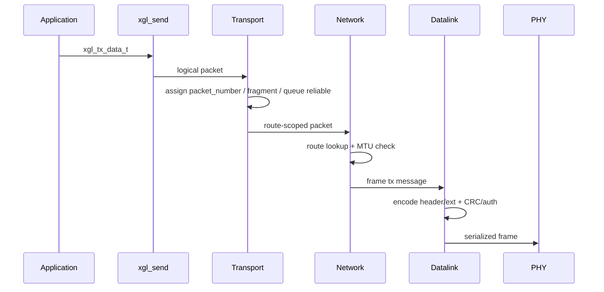
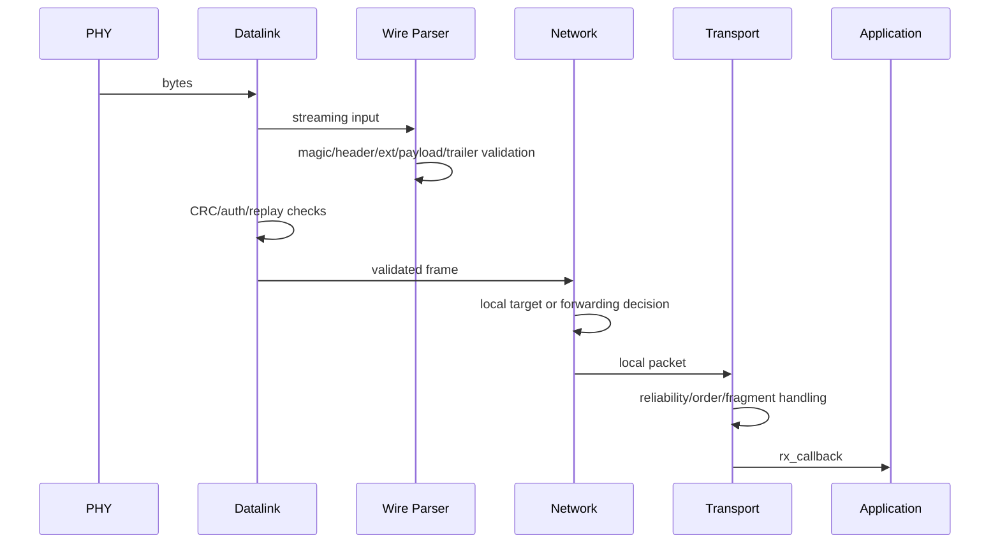
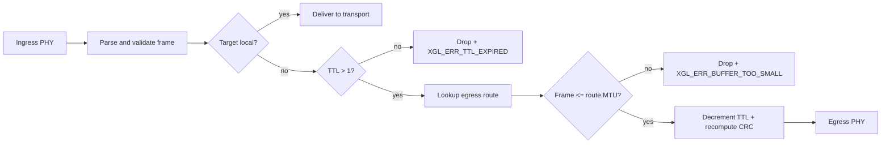

# Architecture

XGL separates protocol logic, hardware drivers, and memory policy. Applications use the public API; internal layers exchange logical packets or serialized frames; platform differences are isolated behind PHY, allocator, time, mutex, and atomic interfaces.

## Module Boundaries

| Module | Directory | Responsibility | Should not own |
| --- | --- | --- | --- |
| API | `src/api` | Instance lifecycle, config validation, send entrypoints, stats | Wire parsing |
| Wire | `src/wire` | v2 header, TLV, CRC, frame parser/serializer | Route decisions |
| Security | `src/security` | Replay window and authentication helpers | Key persistence |
| Memory | `src/memory` | Allocator, pools, packet pool | Application caches |
| Datalink | `src/datalink` | Frame boundaries, raw TX/RX, early authentication checks | Reliable state |
| Network | `src/network` | Route lookup, TTL, forwarding, local delivery | Application callback semantics |
| Transport | `src/transport` | Reliable delivery, ACK/SACK, RTT, fragments, ordered delivery | PHY scheduling |
| Platform | `src/platform` | Time, mutex, atomics, port hooks | Protocol semantics |
| Core | `src/core` | Intrusive list, thread-safe list, hash table, error string | Business logic |

## TX Data Flow



## RX Data Flow



## Forwarding Data Flow



## Lifecycle

| Phase | Allowed | Forbidden |
| --- | --- | --- |
| config | Fill route, allocator, auth provider, callbacks | Reserved `source_id` |
| create/init | Allocate instance and initialize route/reliable/fragment/replay | Missing provider when auth is required |
| runtime | `xgl_run`, send, receive, deadline query | Running parser or auth directly from ISR |
| shutdown | Destroy all protocol resources | Using a destroyed handle |

## Failure Policy

The production path is fail-closed:

- Parameter errors return explicit `xgl_error_t`.
- Header, TLV, CRC, auth, replay, and MTU failures never deliver payload.
- Missing production authentication configuration fails initialization.
- Strict no-heap profiles do not fall back to malloc for NULL allocators.

## Core Tools

The Core layer (`src/core/`, 4 files) provides foundational data structures used throughout the protocol stack.

| Tool | Header | Purpose | Used by |
| --- | --- | --- | --- |
| `xgl_list_t` | `xgl_list.h` | Intrusive doubly-linked list with `XGL_LIST_ENTRY` container macro | Transport RX buffer, fragment reassembly, reliable queue |
| `xgl_list_ts_t` | `xgl_list.h` | Thread-safe wrapper around `xgl_list_t` (mutex-protected, `XGL_THREAD_SAFE` only) | Multi-threaded builds |
| `xgl_hashtable_t` | `xgl_hashtable.h` | Open-chaining hash table, O(1) average lookup, 75% load factor resize | Route table (`src/network/`) |
| `xgl_error.c` | `xgl_error.h` | `xgl_error_string()` — error code to human-readable text | Logging and diagnostics |

Key design notes:

- `xgl_list_t` is intrusive: embed `xgl_list_node_t` in your struct, use `XGL_LIST_ENTRY()` to recover the container. This avoids per-node allocation.
- `xgl_hashtable_t` keys on `uint16_t` (node address). Bucket count must be a power of 2. Initial size is `XGL_HASHTABLE_DEFAULT_SIZE = 16`.
- Thread-safe variants (`xgl_list_ts_t`) add a mutex around each operation. They are only available when `XGL_THREAD_SAFE` is enabled at compile time.
- The Core layer has no dependencies on protocol-layer types; it only depends on `xgl_allocator_t` and basic integer types.

### Evidence

`src/core/xgl_list.c`, `src/core/xgl_list_ts.c`, `src/core/xgl_hashtable.c`, `src/core/xgl_error.c`

## API Exposure

Normal SDK installs only public API headers. Wire, parser, reliable, window, and fragment headers live under `include/xgl/internal` for maintenance, tests, and advanced integrations; they are not stable user ABI.

## Layer Interface Abstraction

Inter-layer communication uses `xgl_layer_interface_t` for decoupling. Each layer (Transport → Network → Datalink) communicates through a unified callback interface without holding direct references to adjacent layer contexts.

### Interface Structure

```text
xgl_layer_interface_t
├── ctx           (void* — opaque layer context)
├── send          (xgl_layer_operation_fn — send to lower layer)
├── receive       (xgl_layer_operation_fn — receive from lower layer)
└── report_error  (xgl_layer_operation_fn — report error to upper layer)
```

All callbacks share a unified signature:

```c
xgl_error_t (*xgl_layer_operation_fn)(void* ctx, xgl_handle_t handle, void* data);
```

The `data` parameter semantics depend on the operation: send/receive passes `xgl_packet_t*`; report_error passes `xgl_layer_error_info_t*`.

### Helper Functions

| Helper | Purpose |
| --- | --- |
| `xgl_layer_interface_init()` | Initialize interface (bind ctx + three callbacks) |
| `xgl_layer_send()` | Call `iface->send()` with NULL check |
| `xgl_layer_receive()` | Call `iface->receive()` with NULL check |
| `xgl_layer_report_error()` | Wrap `xgl_layer_error_info_t` then call `iface->report_error()` |

### Layer Binding

```text
Transport.lower_layer  ──→  Network layer_interface
Network.upper_layer    ──→  Transport (via xgl_layer_contexts_t)
Network.datalink       ──→  Datalink layer_interface
Datalink.upper_layer   ──→  Network
```

`xgl_layer_contexts_t` (defined in `xgl_instance_internal.h`) manages all layer contexts in one place, avoiding circular dependencies.

### Design Constraints

- Each layer only sees adjacent layers' interfaces; no cross-layer direct calls.
- `report_error` propagates upward only; lower layers must not modify upper layer state through this callback.
- `send` / `receive` are synchronous blocking calls, not executed in ISR context.
- Error propagation path: `xgl_transport_report_error()` → `xgl_network_report_error()` → `xgl_datalink_report_error()` → `error_callback` → application
