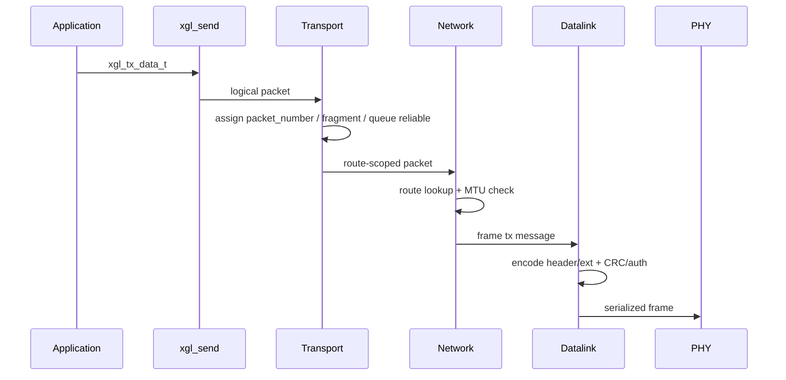
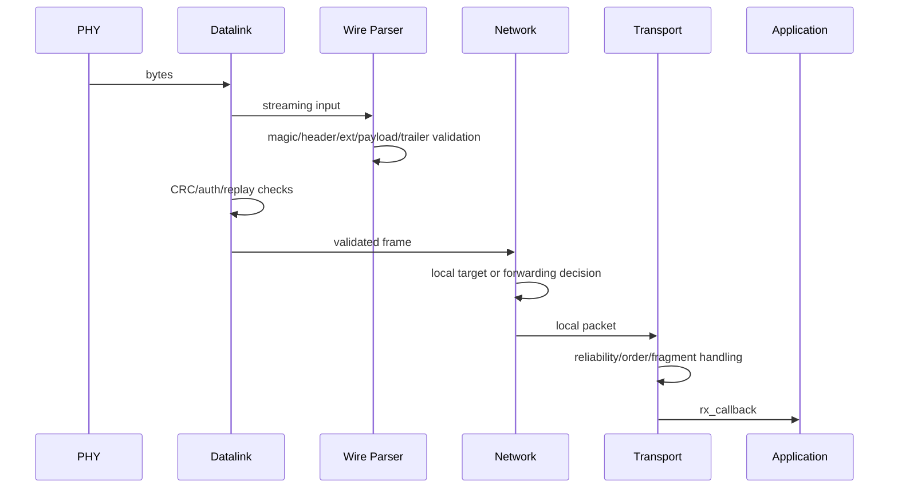
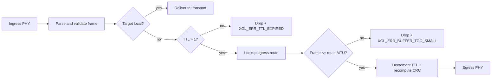

# Architecture

XGL separates protocol logic, hardware drivers, and memory policy. Applications use the public API; internal layers exchange logical packets or serialized frames; platform differences are isolated behind PHY, allocator, time, mutex, and atomic interfaces.

## Module Boundaries

| Module | Directory | Responsibility | Should not own |
| --- | --- | --- | --- |
| API | `src/api` | Instance lifecycle, config validation, send entrypoints, stats | Wire parsing |
| Wire | `src/wire` | v2 header, TLV, CRC, frame parser/serializer | Route decisions |
| Security | `src/security` | Replay window and authentication helpers | Key persistence |
| Memory | `src/memory` | Allocator, pools, packet pool | Application caches |
| Datalink | `src/datalink` | Frame boundaries, raw TX/RX, early authentication checks | Reliable state |
| Network | `src/network` | Route lookup, TTL, forwarding, local delivery | Application callback semantics |
| Transport | `src/transport` | Reliable delivery, ACK/SACK, RTT, fragments, ordered delivery | PHY scheduling |
| Platform | `src/platform` | Time, mutex, atomics, port hooks | Protocol semantics |

## TX Data Flow

## RX Data Flow

## Forwarding Data Flow

## Lifecycle

| Phase | Allowed | Forbidden |
| --- | --- | --- |
| config | Fill route, allocator, auth provider, callbacks | Reserved `source_id` |
| create/init | Allocate instance and initialize route/reliable/fragment/replay | Missing provider when auth is required |
| runtime | `xgl_run`, send, receive, deadline query | Running parser or auth directly from ISR |
| shutdown | Destroy all protocol resources | Using a destroyed handle |

## Failure Policy

The production path is fail-closed:

- Parameter errors return explicit `xgl_error_t`.
- Header, TLV, CRC, auth, replay, and MTU failures never deliver payload.
- Missing production authentication configuration fails initialization.
- Strict no-heap profiles do not fall back to malloc for NULL allocators.

## API Exposure

Normal SDK installs only public API headers. Wire, parser, reliable, window, and fragment headers live under `include/xgl/internal` for maintenance, tests, and advanced integrations; they are not stable user ABI.
