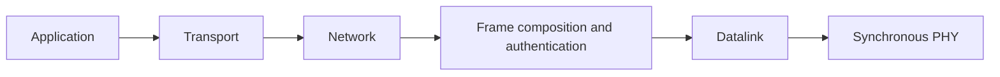

# Architecture

XGen Link owns protocol state. xgen-memory provides allocation services and fixed pools; xgen-containers provides generic containers and bitsets; xgen-bytes, xgen-crc, and xgen-status provide byte encoding, CRC algorithms, and generic statuses. The application owns the clock, execution context, PHY driver and trusted key establishment.

## Module Boundaries

| Module | Responsibility | Boundary |
| --- | --- | --- |
| API | Validate ABI/profile/capacities; construct instances; drive work | Public configuration and explicit timestamps |
| Transport | Exact peer ownership; reliable DATA; ACK; retry; optional messages | Typed logical packet views |
| Network | Route lookup, TLV composition, local authentication, forwarding | Logical packets above, complete frames below |
| Security | Installed directional nonce domains, signing and replay state | Versioned authentication input |
| Datalink | Incremental stream framing and synchronous PHY submission | Borrowed byte spans |
| Wire | One canonical frame parser, serializer and extension encoding | Bounded input and output spans |
| Protocol memory | Reserve resources by their protocol lifetime | Explicit xgm allocation services |

## Send and Receive Flow

```mermaid
flowchart LR
    A[Application] --> T[Transport]
    T --> N[Network]
    N --> W[Frame composition and authentication]
    W --> D[Datalink]
    D --> P[Synchronous PHY]
```

Receive reverses the boundary direction: datalink obtains a complete frame, network decodes it and verifies local authentication before transport changes peer state. A forwarded frame follows the bounded forwarding path and does not create local transport state. Reliable retransmission starts from an owned logical packet and traverses frame composition again, retaining its DATA number while obtaining a fresh security sequence.

## Ownership and Execution

One peer owns one exact `(remote_id, connection_id, session_epoch)` scope, including its window, wait-ACK records, RTT and receive order. Borrowed packet/frame views never outlive a synchronous call; retained payloads have a resource-class owner. Security state is separate from peer lifetime and survives transport RESET.

Calls on one instance are serialized by the caller. Callbacks cannot reenter or destroy that instance. No global clock, internal mutex wrapper, implicit heap fallback or generic container implementation is provided by the protocol library. See [Memory](memory.md) and [Platform](platform.md).
