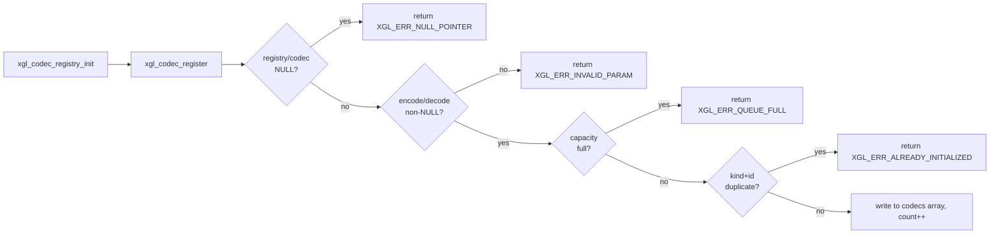
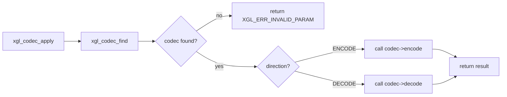

# Codec Layer

The Codec layer provides optional data encoding/decoding capabilities for the XGL protocol stack, including compression and encryption. The full registration and invocation interface is defined, but production paths currently reject compressed or encrypted frames.

## Design Goals

- **Plugin architecture**: Applications register custom codecs via a registry without modifying the protocol stack core.
- **Zero-overhead default**: When no codec is registered, `xgl_codec_apply()` returns immediately with no runtime cost.
- **Separated concerns**: Compression and encryption each have an independent `kind` identifier.

## Core Data Structures

### Codec Descriptor

```text
xgl_codec_t
├── id       (uint8_t — unique codec identifier)
├── kind     (xgl_codec_kind_t — COMPRESSION=1 / ENCRYPTION=2)
├── encode   (xgl_codec_process_fn — encode function pointer)
├── decode   (xgl_codec_process_fn — decode function pointer)
└── user_data(void* — context passed to encode/decode)
```

Each codec must provide both `encode` and `decode` function pointers. Registration validates that both are non-NULL.

### Process Function Signature

```c
xgl_error_t (*xgl_codec_process_fn)(
    const uint8_t* input,
    size_t         input_len,
    uint8_t*       output,
    size_t*        output_len,
    void*          user_data
);
```

- `input` / `input_len`: Input data and its length.
- `output` / `output_len`: Output buffer and its available length; the function writes the actual length used.
- Returns `XGL_OK` on success; other error codes indicate encode/decode failure.

### Codec Registry

```text
xgl_codec_registry_t
├── codecs        (xgl_codec_t* — registry storage array)
├── codec_count   (size_t — number of registered codecs)
└── codec_capacity(size_t — storage array capacity)
```

The registry uses a user-provided static array; no dynamic allocation occurs.

## Operation Flow

### Registration



### Application



### Lookup

`xgl_codec_find()` performs a linear scan over the `(kind, id)` tuple. Since the registry capacity is typically small (≤8), linear lookup is efficient.

## Type Definitions

| Type | Value | Meaning |
| --- | --- | --- |
| `XGL_CODEC_KIND_COMPRESSION` | 1 | Compression codec |
| `XGL_CODEC_KIND_ENCRYPTION` | 2 | Encryption codec |
| `XGL_CODEC_DIRECTION_ENCODE` | 1 | Encode direction |
| `XGL_CODEC_DIRECTION_DECODE` | 2 | Decode direction |

## Current Limitations

!!! warning "Production path status"
    The current production path rejects frames with `COMPRESSED` and `ENCRYPTED` flags. The codec interface is fully defined but not yet wired into the datalink automatic encode/decode pipeline. Compression and encryption are reserved.

### Kconfig Options

- `XGL_ENABLE_COMPRESSION` (default n): Enable compression support (RLE/LZ77/ZLIB).
- `XGL_ENABLE_ENCRYPTION` (default n): Enable encryption support (AES-128/ChaCha20).

These options control compile-time macro definitions only; they do not affect the codec registry itself.

## Layer Relationships

```text
Application (registers codec)
    ↓
Codec Registry (stores codec descriptors)
    ↓ xgl_codec_apply()
Wire (encode: payload → output / decode: input → payload)
    ↓
Datalink (frame serialization/deserialization)
```

The codec layer does not interact directly with datalink or transport. It serves as an independent utility module invoked by the wire layer when needed. The application layer is responsible for registering codecs during instance initialization.

## Evidence

| Rule | Source | Test |
| --- | --- | --- |
| Registry init/register/find/apply | `src/codec/xgl_codec.c` | `test/test_codec.cpp` |
| Codec kind/direction enums | `include/xgl/internal/xgl_codec.h` | `test/test_codec.cpp` |
| Production path rejects compressed/encrypted frames | `src/wire/xgl_wire.c` | `test/test_wire.cpp` |