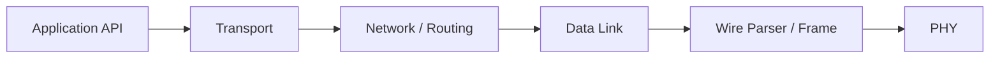

# Protocol Overview

XGL v2 replaces the old small packed-header model with a fixed base header, TLV extensions, and an authentication trailer. The goal is a clear, verifiable, routable protocol that still fits MCU constraints.

## Layer Responsibilities

| Layer | Responsibility |
| --- | --- |
| API | Lifecycle, send APIs, stats, runtime deadlines |
| Transport | Reliable queue, ACK/SACK, RTT, fragments |
| Network | 16-bit nodes, route lookup, TTL, forwarding |
| Data Link / Wire | Header coding, parser, CRC, authentication trailer |
| Platform | Allocator, time, mutex, atomics, PHY callbacks |

## Production Rules

- Every wire field is explicitly little-endian encoded.
- CRC failures, authentication failures, and length violations fail closed.
- Mutable routing fields and security boundaries must stay explicit.
- Embedded profiles must document memory, deadlines, and ISR boundaries.

## How to Read the Full Protocol

- Start with [Architecture](architecture.md) to understand module boundaries and TX/RX flow.
- Then read [Implementation Map](implementation-map.md) to connect protocol rules to source files and tests.
- Read [State Machines](state-machines.md) to understand parser, datalink, network, transport, and fragment runtime states.
- Continue with wire, extensions, reliability, security, routing, and fragmentation pages by topic.
- Before release, review the [Validation Matrix](../reference/validation-matrix.md) and [Production Checklist](../guide/production-checklist.md).
