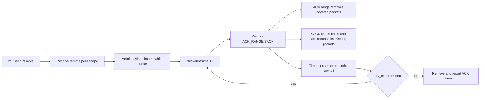
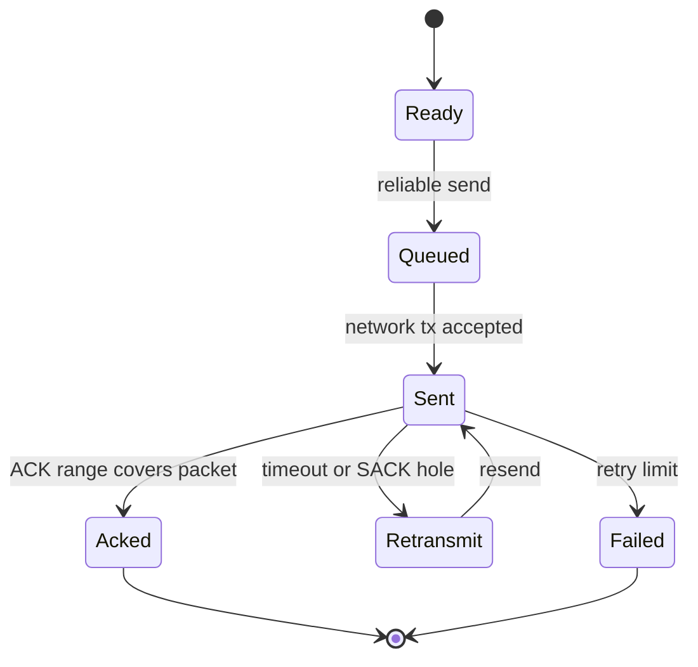

# Reliability

Reliability is managed by connection-scoped peer state, not by 8-bit seq/ack fields.

## Peer Key

```text
remote_peer_id + connection_id + session_epoch
```

`remote_peer_id` is direction-dependent: the TX path uses `target_id`, while
the RX/ACK paths use the incoming packet's `source_id`. This matches
`transport_get_or_create_peer_scope()` and `transport_find_peer_scope()`.

This key isolates:

- reliable queue
- sliding window
- RTT estimator
- RX next packet number
- out-of-order buffer
- replay and reassembly cleanup scope

## ACK and SACK

- ACK_RANGE_EXT can release multiple sent packets at once.
- SACK_EXT describes holes, keeps missing packets pending, and enables fast retransmit.
- ACK_RANGE_EXT and SACK_EXT live in the header TLV area and do not consume payload.
- ACK-only packets do not rely on a single-byte ACK field in the base header.
- ACK and SACK replies preserve `connection_id`, `session_epoch`, and transport `session_id` from the received reliable packet so lost-ACK recovery targets the same peer scope.

### ACK_RANGE_EXT Fields

| Field | Type | Meaning | Source/tests |
| --- | --- | --- | --- |
| `largest_ack` | u32 | Highest packet number described by this ACK frame | `src/wire/xgl_wire_ack_ext.c`, `test/test_wire.cpp` |
| `ack_delay_us` | u32 | Encoded ACK delay metadata; current tests validate round-trip encoding | `src/wire/xgl_wire_ack_ext.c`, `test/test_wire.cpp` |
| `range_count` | u8 | Number of repeated ranges | `src/wire/xgl_wire_ack_ext.c`, `test/test_reliable.cpp` |
| `gap` | u16 | Distance from the previous acknowledged range when walking backward | `src/transport/xgl_reliable_ack.c`, `test/test_reliable.cpp` |
| `length` | u16 | Number of packets covered by the range | `src/transport/xgl_reliable_ack.c`, `test/test_reliable.cpp` |

### SACK_EXT Fields

| Field | Type | Meaning | Source/tests |
| --- | --- | --- | --- |
| `base_packet` | u32 | First packet number represented by the bitmap | `src/wire/xgl_wire_ack_ext.c`, `test/test_wire.cpp` |
| `bitmap_len` | u8 | Number of bitmap bytes | `src/wire/xgl_wire_ack_ext.c`, `test/test_wire.cpp` |
| `bitmap` | bytes | Bit `n` describes receive state for `base_packet + n` | `src/transport/xgl_transport_sack.c`, `test/test_transport.cpp` |

An all-zero SACK bitmap is valid. It preserves `base_packet` as a known hole
and allows the sender to fast-retransmit the missing packet while removing
packets that are explicitly marked received.

### Reliable Data Flow



## Sender State



The sender reliable queue uses packet-number index buckets to accelerate lookup. Small windows may still tolerate list traversal, but ACK/SACK paths should not degrade to full queue scans.

Reliable transmission is transactional: queue admission happens before the packet is handed to the network layer. If admission fails, nothing is transmitted. If network transmission fails, the queued record is removed. Packet numbers and window state are committed only after the network layer accepts the send.

## Receiver State

| Condition | Behavior |
| --- | --- |
| `packet_number == rx_next_packet_number` | Deliver and advance contiguous window |
| `packet_number > rx_next_packet_number` | Cache in out-of-order buffer and ACK/SACK |
| `packet_number < rx_next_packet_number` | Treat as duplicate or old packet, do not redeliver |
| connection/session mismatch | Reject without polluting other peer state |

## Ordered Delivery

The receiver buffers out-of-order packets by packet number. Only contiguous payloads starting at `rx_next_packet_number` are delivered to the application callback.

## Reset / Close

RESET and CLOSE clear only the matching peer, connection, and session. They do not globally reset ACK, fragment, or replay state.

## Observability

Reliability should surface retransmit, ACK timeout, window-full, and drop counters through statistics. Production debugging should first inspect route MTU, auth/replay rejects, and reliable queue peak usage.
