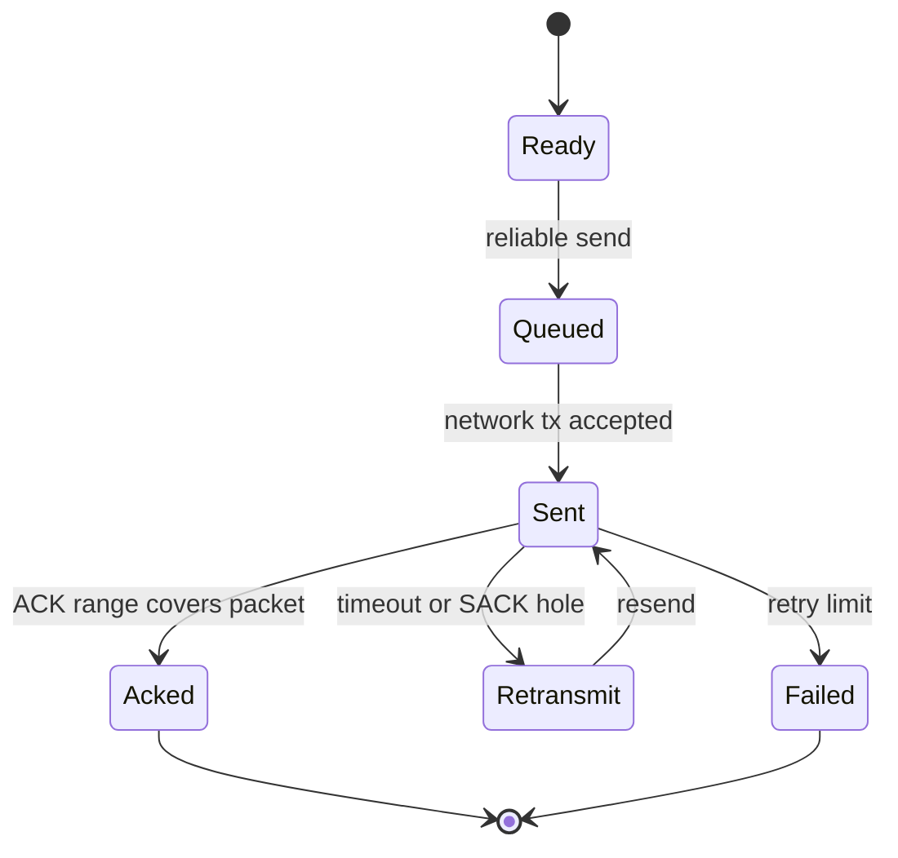

# Reliability

Reliability is managed by connection-scoped peer state, not by 8-bit seq/ack fields.

## Peer Key

```text
target_id + connection_id + session_epoch
```

This key isolates:

- reliable queue
- sliding window
- RTT estimator
- RX next packet number
- out-of-order buffer
- replay and reassembly cleanup scope

## ACK and SACK

- ACK_RANGE_EXT can release multiple sent packets at once.
- SACK_EXT describes holes, keeps missing packets pending, and enables fast retransmit.
- ACK-only packets do not rely on a single-byte ACK field in the base header.

## Sender State



The sender reliable queue uses packet-number index buckets to accelerate lookup. Small windows may still tolerate list traversal, but ACK/SACK paths should not degrade to full queue scans.

## Receiver State

| Condition | Behavior |
| --- | --- |
| `packet_number == rx_next_packet_number` | Deliver and advance contiguous window |
| `packet_number > rx_next_packet_number` | Cache in out-of-order buffer and ACK/SACK |
| `packet_number < rx_next_packet_number` | Treat as duplicate or old packet, do not redeliver |
| connection/session mismatch | Reject without polluting other peer state |

## Ordered Delivery

The receiver buffers out-of-order packets by packet number. Only contiguous payloads starting at `rx_next_packet_number` are delivered to the application callback.

## Reset / Close

RESET and CLOSE clear only the matching peer, connection, and session. They do not globally reset ACK, fragment, or replay state.

## Observability

Reliability should surface retransmit, ACK timeout, window-full, and drop counters through statistics. Production debugging should first inspect route MTU, auth/replay rejects, and reliable queue peak usage.
