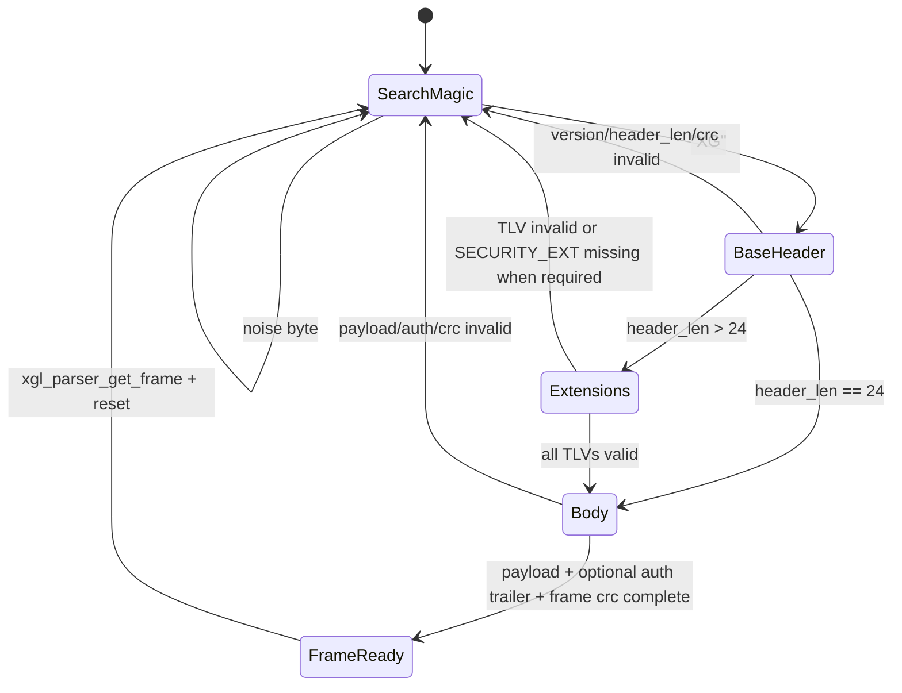
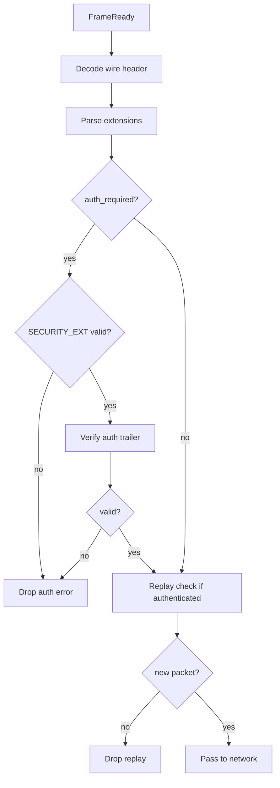
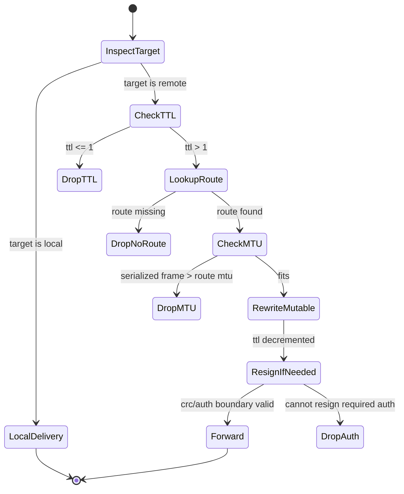
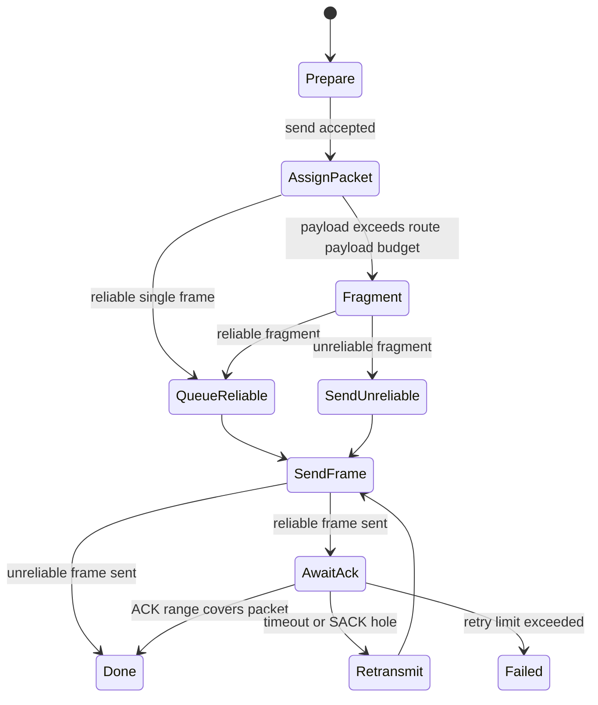
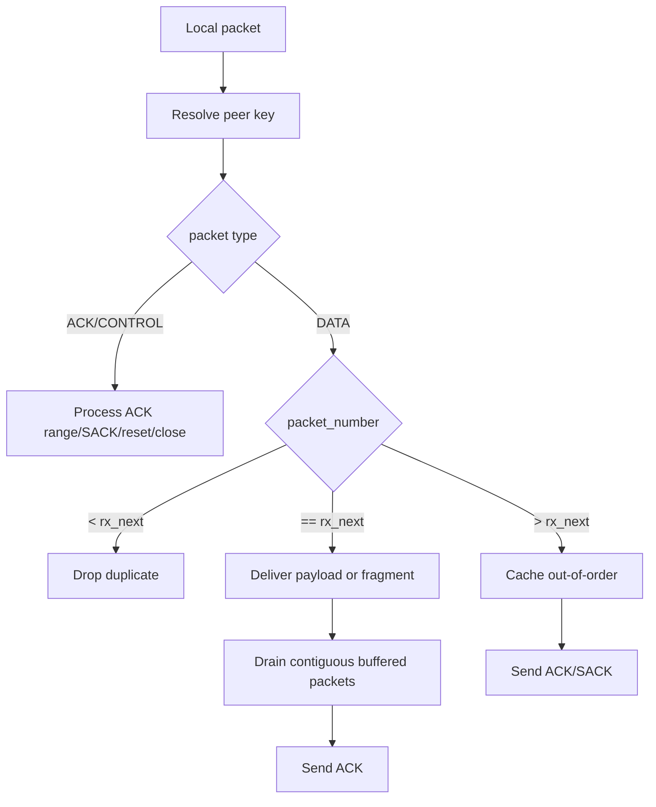
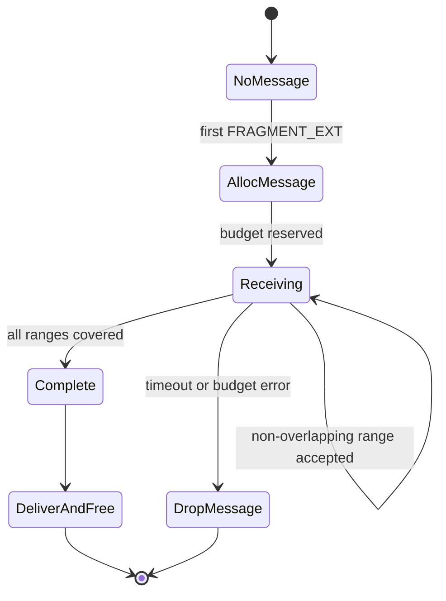

# Protocol State Machines

This page describes the core XGL v2 state machines. They are the shared language for implementation, testing, and debugging.

## Parser State Machine



Requirements:

- `SearchMagic` must handle noise and overlapping magic.
- `BaseHeader` reads only the 24-byte base header and must not trust payload early.
- `Extensions` walks TLVs with a cursor; any overrun resets the parser.
- `Body` length is derived from `payload_len + auth_tag_len + frame_crc16`.

## Datalink Validation State Machine



Authentication failure, replay failure, and key mismatch must not be ACKed and must not enter transport.

## Network Forwarding State Machine



TTL is a mutable header field. Forwarding must recompute header CRC; authenticated frames must remain verifiable by the next hop.

## Transport Send State Machine



Constraints:

- Packet numbers are monotonic per peer key.
- Reliable payload copies cannot be released before ACK coverage.
- Retry failure affects only the scoped peer/connection/session.

## Transport Receive State Machine



The application callback receives only ordered, complete, authenticated, budget-compliant payloads.

## Fragment Reassembly State Machine



Reassembly key:

```text
source_id + connection_id + session_epoch + message_id
```

The key prevents the same `message_id` from being mixed across nodes, connections, or sessions.

## Reset/CLOSE Scope

RESET and CLOSE must only clear the matching scope:

```text
target/source node + connection_id + session_epoch
```

They must not globally clear the route table, other peers' reliable queues, other sessions' replay windows, or unrelated fragment reassembly state.
