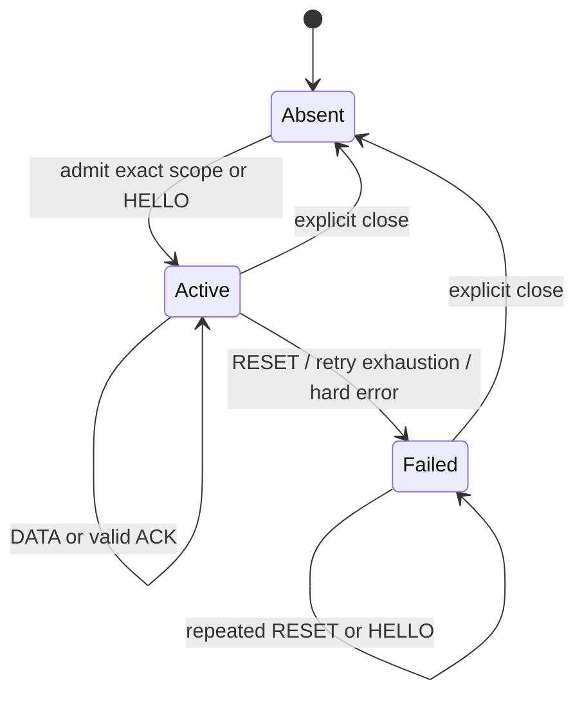
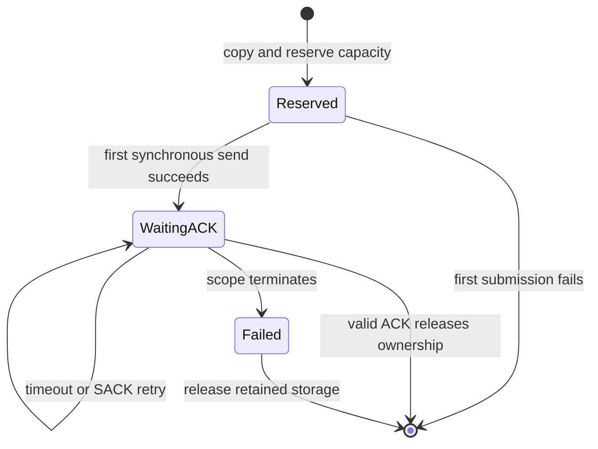

# State Machines

State transitions belong to exact scopes. Application intent, reliable DATA numbering and authentication replay state are separate lifecycles.

## Peer Lifecycle

```mermaid
stateDiagram-v2
    [*] --> Absent
    Absent --> Active: admit exact scope or HELLO
    Active --> Active: DATA or valid ACK
    Active --> Failed: RESET / retry exhaustion / hard error
    Failed --> Failed: repeated RESET or HELLO
    Active --> Absent: explicit close
    Failed --> Absent: explicit close
```

A failed epoch is terminal. Closing releases transport capacity; a new connection attempt uses a new epoch. Closing pending accepted work reports cancellation once. RESET finds only an existing exact scope and never allocates or reopens it. HELLO is idempotent and does not reset counters.

Idle reclamation is restricted to an empty peer that has never consumed TX reliable numbers and has no RX reliable-number state. Once either direction has reliable history, idle time cannot erase its duplicate protection or restart numbering. Such a scope remains until explicit close; its idle timer is excluded from timeout queries.

## Reliable Packet Lifecycle

```mermaid
stateDiagram-v2
    [*] --> Reserved: copy and reserve capacity
    Reserved --> WaitingACK: first synchronous send succeeds
    Reserved --> [*]: first submission fails
    WaitingACK --> WaitingACK: timeout or SACK retry
    WaitingACK --> [*]: valid ACK releases ownership
    WaitingACK --> Failed: scope terminates
    Failed --> [*]: release retained storage
```

An accepted fragmented message additionally owns its unsent tail. Window exhaustion pauses its pump; ACK or later step advances it. Application BUSY can retain an accepted receive packet or complete message. Temporary backpressure is not permission to drop acknowledged bytes.

## Security Lifecycle

Explicit installation creates a trusted directional association. A signing attempt burns its reserved sequence even on provider failure. Successful verification commits a replay-window update; failed verification commits none. Transport RESET does not change this state.

Security close retires the association and retains a tombstone. Installation immediately reserves directional `(key_id, nonce_prefix)` domains. The same scope and reserved domains cannot be reinstalled in that context; the application is responsible for preventing actual-key aliases across different IDs. Session slots therefore count closed tombstones too. Fresh trust or persisted freshness is needed across a device restart; a RAM reset is not an authenticated new epoch.
