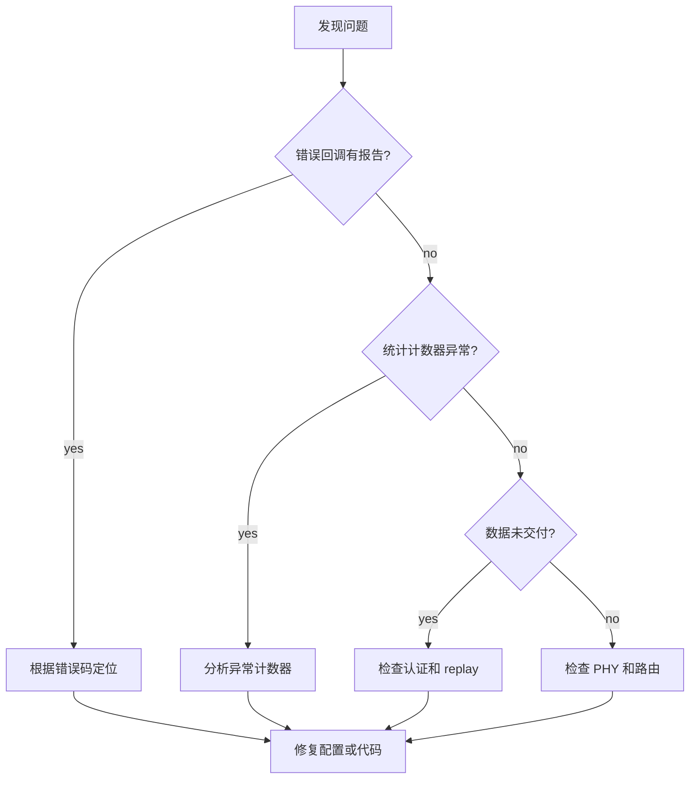

# 诊断与调试指南

本文档提供 XGL 协议栈的常见问题诊断方法、调试工具使用和问题排查流程。

## 常见问题分类

### 初始化问题

| 现象 | 可能原因 | 排查步骤 |
| --- | --- | --- |
| `xgl_init()` 返回错误 | 配置参数无效 | 检查 `xgl_config_validate()` 返回值 |
| 实例创建失败 | 内存池耗尽 | 检查 `TX_POOL_SIZE` 和 `RX_BUFFER_SIZE` |
| 认证初始化失败 | 缺少 auth_provider | 确保 `auth_required=true` 时提供 provider |

### 发送问题

| 现象 | 可能原因 | 排查步骤 |
| --- | --- | --- |
| `xgl_send()` 返回 `XGL_ERR_WINDOW_FULL` | 滑动窗口已满 | 增大 `window_size` 或等待 ACK |
| `xgl_send()` 返回 `XGL_ERR_BUFFER_TOO_SMALL` | payload 超过 MTU 且分片禁用 | 启用分片或减小 payload |
| 发送无响应 | 路由未配置 | 检查 `routes[]` 配置 |

### 接收问题

| 现象 | 可能原因 | 排查步骤 |
| --- | --- | --- |
| 收不到数据 | PHY 回调未注册 | 检查 `phy.rx` 回调 |
| 收到数据但未交付 | 认证失败 | 检查 `auth_required` 和 auth_provider |
| 数据乱序 | 网络路径不一致 | 检查路由配置和网络拓扑 |

## 调试工具

### 统计计数器

通过 `xgl_get_statistics()` 获取运行时统计:

```c
xgl_statistics_t stats;
xgl_get_statistics(instance, &stats);

// 关键计数器
printf("TX frames: %lu, RX frames: %lu\n",
       stats.datalink.tx_frames, stats.datalink.rx_frames);
printf("CRC errors: %lu, Auth failures: %lu\n",
       stats.datalink.rx_crc16_errors, stats.datalink.rx_auth_failures);
printf("Retries: %lu, ACK timeouts: %lu\n",
       stats.transport.tx_retries, stats.transport.tx_ack_timeouts);
```

### 错误回调

注册错误回调捕获运行时错误:

```c
void my_error_callback(xgl_error_t error, const char* message, void* user_data) {
    printf("XGL Error %d: %s\n", error, message);
}

xgl_config_t config = {0};
config.callbacks.error_callback = my_error_callback;
```

### 日志系统

启用日志需要 Kconfig 配置:

```text
XGL_ENABLE_LOGGING=y
XGL_LOG_LEVEL_DEBUG=y  # 或 VERBOSE
```

### 平台信息

```c
xgl_platform_info_t info;
xgl_platform_get_info(&info);
printf("Platform: %s %s on %s\n", info.compiler_name, info.arch_name, info.os_name);
```

## 问题排查流程



## 常见错误码排查

| 错误码 | 含义 | 常见原因 |
| --- | --- | --- |
| `XGL_ERR_INVALID_PARAM` | 参数无效 | 检查函数参数 |
| `XGL_ERR_NO_MEMORY` | 内存不足 | 增大内存池 |
| `XGL_ERR_ROUTE_NOT_FOUND` | 路由未找到 | 检查路由配置 |
| `XGL_ERR_TIMEOUT` | 操作超时 | 检查网络延迟和超时设置 |
| `XGL_ERR_ACK_TIMEOUT` | ACK 超时 | 检查对端是否可达 |
| `XGL_ERR_TTL_EXPIRED` | TTL 过期 | 检查路由跳数 |
| `XGL_ERR_INVALID_FRAME` | 帧无效 | 检查 PHY 传输质量 |
| `XGL_ERR_CRC_FAILED` | CRC 失败 | 检查数据完整性 |
| `XGL_ERR_QUEUE_FULL` | 队列满 | 增大队列容量 |
| `XGL_ERR_WINDOW_FULL` | 窗口满 | 增大窗口或等待 ACK |

## 性能问题诊断

### 高延迟

1. 检查 RTT 估计器: `xgl_rtt_get_rto()`。
2. 检查重传计数: 高重传率表明链路质量差。
3. 检查窗口利用率: 窗口满说明发送速度超过接收能力。

### 低吞吐量

1. 检查滑动窗口大小: 太小会限制并发。
2. 检查 MTU: 太小会导致频繁分片。
3. 检查 PHY 速度: 物理层是瓶颈。

### 内存问题

1. 使用 tracking allocator 查看各阶段内存使用。
2. 检查 packet pool 峰值使用。
3. 检查重组 buffer 使用情况。

## 证据

| 工具 | 源码 |
| --- | --- |
| 统计查询 | `src/api/xgl_stats.c` |
| 错误字符串 | `include/xgl/xgl_error.h` |
| 平台信息 | `src/platform/xgl_platform.c` |