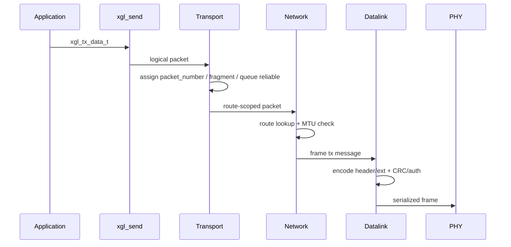
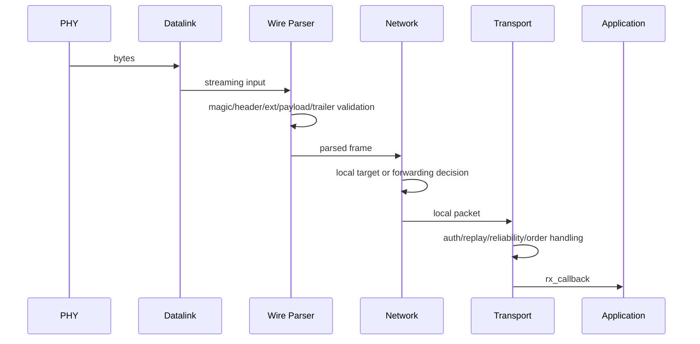

# 架构设计

XGL 的架构目标是让协议逻辑、硬件驱动和内存策略解耦。应用只使用公共 API；协议内部按层传递逻辑 packet 或 serialized frame；平台差异通过 PHY、allocator、time、mutex 和 atomic 接口隔离。

## 模块边界

| 模块 | 目录 | 核心职责 | 不应承担 |
| --- | --- | --- | --- |
| API | `src/api` | 实例生命周期、配置校验、发送入口、统计 | wire 字段解析 |
| Wire | `src/wire` | v2 header、TLV、CRC、frame parser/serializer | 路由决策 |
| Security | `src/security` | replay window、认证辅助 | 密钥持久化 |
| Memory | `src/memory` | allocator、pool、packet pool | 业务缓存 |
| Datalink | `src/datalink` | frame 边界、raw TX/RX、认证前置检查 | reliable 状态 |
| Network | `src/network` | route lookup、TTL、forwarding、本地交付 | 应用 callback |
| Transport | `src/transport` | reliable、ACK/SACK、RTT、fragment、ordered delivery | PHY 调度 |
| Platform | `src/platform` | time、mutex、atomic、port hooks | 协议语义 |

## TX 数据流

## RX 数据流

## Forwarding 数据流

## 生命周期

| 阶段 | 允许行为 | 禁止行为 |
| --- | --- | --- |
| config | 填写 route、allocator、auth provider、callback | 传入保留 source_id |
| create/init | 分配实例、初始化 route/reliable/fragment/replay | 在 auth_required 下缺 provider |
| runtime | `xgl_run`、send、receive、deadline 查询 | ISR 直接跑 parser 或 auth |
| shutdown | destroy 清理所有协议资源 | 使用已销毁 handle |

## 失效策略

XGL 的生产路径偏 fail-closed：

- 参数错误返回明确 `xgl_error_t`。
- header、TLV、CRC、auth、replay、MTU 失败不交付 payload。
- 生产认证配置缺失时初始化失败。
- strict no-heap profile 中 NULL allocator 不回退到 malloc。

## API 暴露原则

普通 SDK 只安装公共 API 头。wire、parser、reliable、window、fragment 等内部头用于协议维护和测试，不作为稳定用户 ABI。
