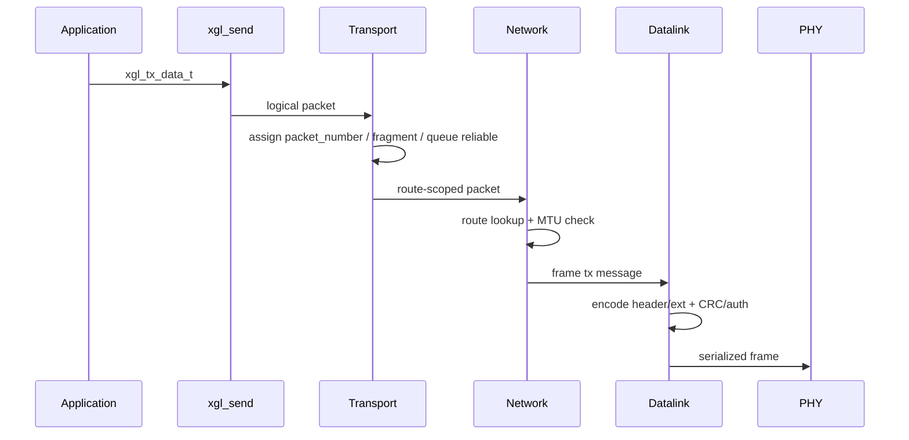
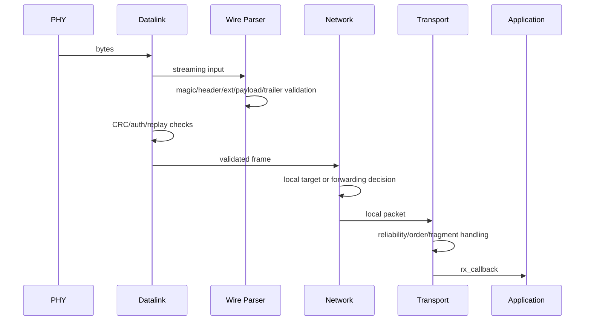
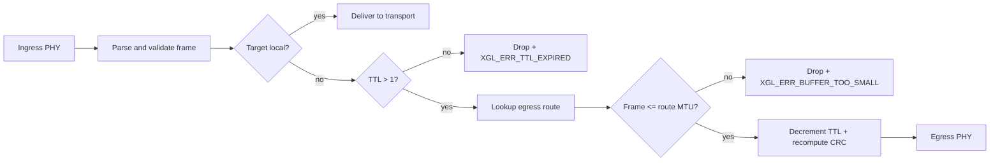

# 架构设计

XGL 的架构目标是让协议逻辑、硬件驱动和内存策略解耦。应用只使用公共 API；协议内部按层传递逻辑 packet 或 serialized frame；平台差异通过 PHY、allocator、time、mutex 和 atomic 接口隔离。

## 模块边界

| 模块 | 目录 | 核心职责 | 不应承担 |
| --- | --- | --- | --- |
| API | `src/api` | 实例生命周期、配置校验、发送入口、统计 | wire 字段解析 |
| Wire | `src/wire` | v2 header、TLV、CRC、frame parser/serializer | 路由决策 |
| Security | `src/security` | replay window、认证辅助 | 密钥持久化 |
| Memory | `src/memory` | allocator、pool、packet pool | 业务缓存 |
| Datalink | `src/datalink` | frame 边界、raw TX/RX、认证前置检查 | reliable 状态 |
| Network | `src/network` | route lookup、TTL、forwarding、本地交付 | 应用 callback |
| Transport | `src/transport` | reliable、ACK/SACK、RTT、fragment、ordered delivery | PHY 调度 |
| Platform | `src/platform` | time、mutex、atomic、port hooks | 协议语义 |
| Core | `src/core` | intrusive list、thread-safe list、hashtable、error string | 业务逻辑 |

## TX 数据流



## RX 数据流



## Forwarding 数据流



## 生命周期

| 阶段 | 允许行为 | 禁止行为 |
| --- | --- | --- |
| config | 填写 route、allocator、auth provider、callback | 传入保留 source_id |
| create/init | 分配实例、初始化 route/reliable/fragment/replay | 在 auth_required 下缺 provider |
| runtime | `xgl_run`、send、receive、deadline 查询 | ISR 直接跑 parser 或 auth |
| shutdown | destroy 清理所有协议资源 | 使用已销毁 handle |

## 失效策略

XGL 的生产路径偏 fail-closed：

- 参数错误返回明确 `xgl_error_t`。
- header、TLV、CRC、auth、replay、MTU 失败不交付 payload。
- 生产认证配置缺失时初始化失败。
- strict no-heap profile 中 NULL allocator 不回退到 malloc。

## Core 工具层

Core 层（`src/core/`，4 个文件）提供协议栈全局使用的基础数据结构。

| 工具 | 头文件 | 用途 | 使用者 |
| --- | --- | --- | --- |
| `xgl_list_t` | `xgl_list.h` | intrusive 双向链表，支持 `XGL_LIST_ENTRY` container 宏 | Transport RX buffer、fragment reassembly、reliable queue |
| `xgl_list_ts_t` | `xgl_list.h` | 线程安全链表包装（mutex 保护，仅 `XGL_THREAD_SAFE` 编译时可用） | 多线程构建 |
| `xgl_hashtable_t` | `xgl_hashtable.h` | 开链 hash table，O(1) 平均查找，75% 负载因子触发 resize | 路由表（`src/network/`） |
| `xgl_error.c` | `xgl_error.h` | `xgl_error_string()` — 错误码转可读文本 | 日志和诊断 |

设计要点：

- `xgl_list_t` 是 intrusive 的：在结构体中嵌入 `xgl_list_node_t`，通过 `XGL_LIST_ENTRY()` 宏恢复容器指针。避免逐节点分配。
- `xgl_hashtable_t` 以 `uint16_t`（节点地址）为键。桶数必须是 2 的幂，初始大小 `XGL_HASHTABLE_DEFAULT_SIZE = 16`。
- 线程安全变体（`xgl_list_ts_t`）在每次操作外包一层 mutex，仅在 `XGL_THREAD_SAFE` 编译时可用。
- Core 层不依赖协议层类型，仅依赖 `xgl_allocator_t` 和基础整数类型。

### 证据

`src/core/xgl_list.c`、`src/core/xgl_list_ts.c`、`src/core/xgl_hashtable.c`、`src/core/xgl_error.c`

## API 暴露原则

普通 SDK 只安装公共 API 头。wire、parser、reliable、window、fragment 等内部头位于 `include/xgl/internal`，用于协议维护、测试和高级集成，不作为稳定用户 ABI。

## Layer Interface 抽象

协议栈的层间通信通过 `xgl_layer_interface_t` 实现解耦。每层（Transport → Network → Datalink）通过统一的回调接口交互，不直接持有相邻层的上下文指针。

### 接口结构

```text
xgl_layer_interface_t
├── ctx           (void* — 层上下文，不透明)
├── send          (xgl_layer_operation_fn — 向下层发送)
├── receive       (xgl_layer_operation_fn — 从下层接收)
└── report_error  (xgl_layer_operation_fn — 向上层报告错误)
```

所有回调共享统一签名：

```c
xgl_error_t (*xgl_layer_operation_fn)(void* ctx, xgl_handle_t handle, void* data);
```

`data` 参数的语义取决于操作：send/receive 传递 `xgl_packet_t*`，report_error 传递 `xgl_layer_error_info_t*`。

### 内联 Helper

| Helper | 作用 |
| --- | --- |
| `xgl_layer_interface_init()` | 初始化 interface（绑定 ctx + 三回调） |
| `xgl_layer_send()` | 调用 `iface->send()`，带 NULL 检查 |
| `xgl_layer_receive()` | 调用 `iface->receive()`，带 NULL 检查 |
| `xgl_layer_report_error()` | 封装 `xgl_layer_error_info_t` 后调用 `iface->report_error()` |

### 层间绑定

```text
Transport.lower_layer  ──→  Network layer_interface
Network.upper_layer    ──→  Transport (通过 xgl_layer_contexts_t)
Network.datalink       ──→  Datalink layer_interface
Datalink.upper_layer   ──→  Network
```

`xgl_layer_contexts_t`（定义在 `xgl_instance_internal.h`）统一管理所有层上下文，避免循环依赖。

### 设计约束

- 每层只能看到相邻层的 interface，不能跨层直接调用。
- `report_error` 单向向上传递，不允许下层通过此回调修改上层状态。
- `send` / `receive` 是同步阻塞调用，不在 ISR 中执行。
- 错误传播路径：`xgl_transport_report_error()` → `xgl_network_report_error()` → `xgl_datalink_report_error()` → `error_callback` → 应用
