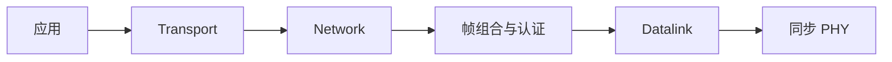

# 架构

XGen Link 负责协议状态。xgen-memory 提供分配服务与固定池，xgen-containers 提供通用容器与位图，xgen-bytes、xgen-crc、xgen-status 分别提供字节编码、CRC 算法与通用状态。应用负责时钟、执行上下文、PHY 驱动与可信密钥建立。

## 模块边界

| 模块 | 职责 | 边界 |
| --- | --- | --- |
| API | 校验 ABI/profile/容量；构造实例；驱动执行 | 公开配置与显式时间戳 |
| Transport | 精确 peer 所有权；可靠 DATA；ACK；重试；可选消息层 | 有类型的逻辑包视图 |
| Network | 路由查找、TLV 组合、本地认证、转发 | 上层逻辑包，下层完整帧 |
| Security | 安装方向性 nonce 域、签名与重放状态 | 带版本的认证输入 |
| Datalink | 增量流组帧与同步 PHY 提交 | 借用字节区间 |
| Wire | 唯一规范帧解析器、序列化器与扩展编码 | 有界输入输出区间 |
| 协议内存 | 按协议生命周期预留资源 | 显式 xgm 分配服务 |

## 发送与接收流程

```mermaid
flowchart LR
    A[应用] --> T[Transport]
    T --> N[Network]
    N --> W[帧组合与认证]
    W --> D[Datalink]
    D --> P[同步 PHY]
```

接收按相反方向经过这些边界：datalink 获取完整帧，network 解码并完成本地认证后，transport 才修改 peer 状态。转发帧走有界转发路径，不创建本地 transport 状态。可靠重传从持有的逻辑包重新组合帧，保留 DATA 编号并取得新的安全序号。

## 所有权与执行

一个 peer 唯一持有 `(remote_id, connection_id, session_epoch)` 对应的窗口、等待 ACK 记录、RTT 和接收顺序。借用的包/帧视图不得超出同步调用；需要保留的载荷由明确资源类别持有。安全状态独立于 peer 生命周期，不随 transport RESET 清除。

同一实例由调用方串行访问。回调不得重入或销毁该实例。协议库不提供全局时钟、内部互斥包装、隐式堆回退或通用容器实现。参见[内存](memory.md)与[平台](platform.md)。
