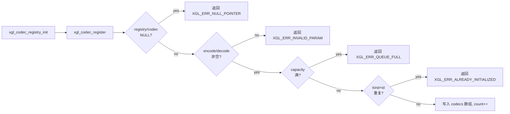
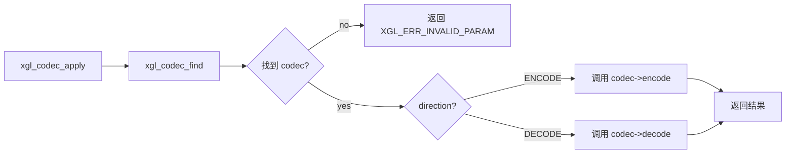

# Codec 层

Codec 层为 XGL 协议栈提供可选的数据编解码能力,包括压缩和加密。当前定义了完整的注册和调用接口,但生产路径暂时拒绝启用压缩或加密帧。

## 设计目标

- **插件化**:通过注册表模式,应用层可以注册自定义编解码器,无需修改协议栈核心代码。
- **零开销默认**:未注册 codec 时,`xgl_codec_apply()` 直接返回,不产生运行时开销。
- **隔离编解码职责**:compression 和 encryption 各有独立的 kind 标识,互不干扰。

## 核心数据结构

### Codec 描述符

```text
xgl_codec_t
├── id       (uint8_t — codec 唯一标识)
├── kind     (xgl_codec_kind_t — COMPRESSION=1 / ENCRYPTION=2)
├── encode   (xgl_codec_process_fn — 编码函数指针)
├── decode   (xgl_codec_process_fn — 解码函数指针)
└── user_data(void* — 传递给 encode/decode 的上下文)
```

每个 codec 必须同时提供 `encode` 和 `decode` 函数指针,注册时校验两者非空。

### 编解码函数签名

```c
xgl_error_t (*xgl_codec_process_fn)(
    const uint8_t* input,
    size_t         input_len,
    uint8_t*       output,
    size_t*        output_len,
    void*          user_data
);
```

- `input` / `input_len`: 输入数据及其长度。
- `output` / `output_len`: 输出缓冲区及其可用长度,函数写入实际使用的长度。
- 返回 `XGL_OK` 表示成功,其他错误码表示编解码失败。

### Codec 注册表

```text
xgl_codec_registry_t
├── codecs       (xgl_codec_t* — 注册表存储数组)
├── codec_count  (size_t — 已注册数量)
└── codec_capacity(size_t — 存储数组容量)
```

注册表使用用户提供的静态数组存储 codec 描述符,不动态分配内存。

## 操作流程

### 注册流程



### 应用流程



### 查找方式

`xgl_codec_find()` 通过线性扫描 `(kind, id)` 二元组定位 codec。由于注册表容量通常很小(≤8),线性查找足够高效。

## 类型定义

| 类型 | 值 | 含义 |
| --- | --- | --- |
| `XGL_CODEC_KIND_COMPRESSION` | 1 | 压缩 codec |
| `XGL_CODEC_KIND_ENCRYPTION` | 2 | 加密 codec |
| `XGL_CODEC_DIRECTION_ENCODE` | 1 | 编码方向 |
| `XGL_CODEC_DIRECTION_DECODE` | 2 | 解码方向 |

## 当前限制

!!! warning "生产路径状态"
    当前协议栈的生产路径会拒绝 `COMPRESSED` 和 `ENCRYPTED` flag 的帧。Codec 接口已完整定义,但尚未接入 datalink 层的自动编解码管线。压缩和加密功能处于 reserved 状态。

### Kconfig 配置

- `XGL_ENABLE_COMPRESSION` (默认 n): 启用压缩支持,可选 RLE/LZ77/ZLIB。
- `XGL_ENABLE_ENCRYPTION` (默认 n): 启用加密支持,可选 AES-128/ChaCha20。

这两个配置项当前仅控制编译时宏定义,不影响 codec 注册表本身。

## 与其他层的关系

```text
Application (注册 codec)
    ↓
Codec Registry (存储 codec 描述符)
    ↓ xgl_codec_apply()
Wire (编码: payload → output / 解码: input → payload)
    ↓
Datalink (帧序列化/反序列化)
```

Codec 层不直接与 datalink 或 transport 交互。它作为一个独立的工具模块,被 wire 层在需要时调用。应用层负责在实例初始化阶段注册所需的 codec。

## 证据

| 规则 | 源码 | 测试 |
| --- | --- | --- |
| Registry init/register/find/apply | `src/codec/xgl_codec.c` | `test/test_codec.cpp` |
| Codec kind/direction 枚举 | `include/xgl/internal/xgl_codec.h` | `test/test_codec.cpp` |
| 生产路径拒绝压缩/加密帧 | `src/wire/xgl_wire.c` | `test/test_wire.cpp` |