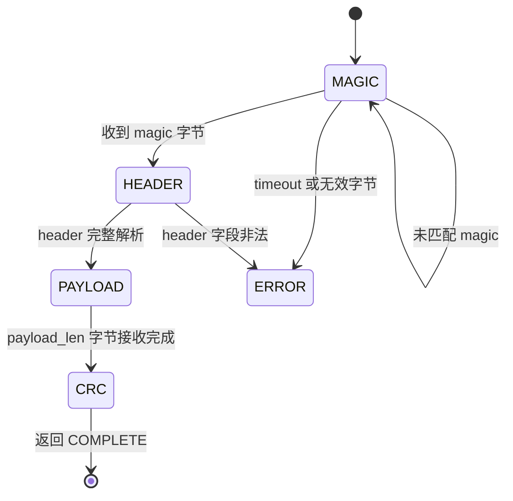
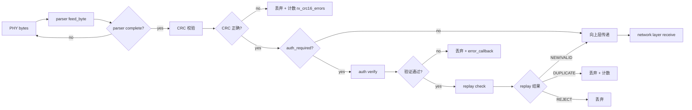
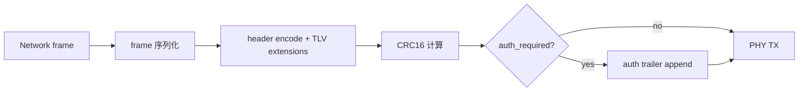

# Datalink 层

Datalink 层是 XGL 协议栈中连接物理层(PHY)和网络层(Network)的桥梁。它负责帧边界检测、认证验证、反重放检查和帧的序列化/反序列化。

## 设计目标

- **帧完整性**:通过 parser 状态机实现字节流到完整帧的解析,CRC 校验确保数据正确。
- **认证前置**:在进入网络层之前完成认证验证和反重放检查,保护上层免受伪造帧攻击。
- **层间解耦**:通过 `xgl_layer_interface_t` 与网络层交互,不直接持有网络层上下文。

## 上下文结构

```text
xgl_datalink_ctx_t
├── parser              (xgl_parser_t — 帧解析器状态机)
├── rx_cache            (uint8_t* — 接收缓存)
├── rx_cache_size       (size_t — 缓存大小)
├── stats               (xgl_layer_stats_t* — 层统计)
├── error_callback      (xgl_error_callback_t — 错误回调)
├── source_id           (uint16_t — 本地节点 ID)
├── auth_required       (bool — 是否要求认证)
├── auth_key_id         (uint32_t — 当前认证密钥 ID)
├── auth_provider       (xgl_auth_provider_t* — 认证回调)
├── replay_windows[16]  (xgl_replay_window_t — 反重放窗口)
├── replay_window_used[16] (bool — 槽位占用标记)
└── upper_layer         (xgl_layer_interface_t* — 上层接口)
```

## Parser 状态机

Parser 将 PHY 接收的字节流解析为完整帧,经历 4 个状态:



### 状态说明

| 状态 | 行为 | 超时处理 |
| --- | --- | --- |
| MAGIC | 逐字节匹配帧起始 magic | 1000ms 无完整帧则重置 |
| HEADER | 缓存并解析 24 字节基础头 + TLV 扩展 | — |
| PAYLOAD | 接收 payload_len 字节载荷 | — |
| CRC | 验证帧 CRC16 | — |

### Parser 超时

- 默认超时: `XGL_PARSER_TIMEOUT_MS = 1000` ms
- 超时后 parser 重置到 MAGIC 状态,丢弃已缓存数据
- 防止攻击者发送不完整帧耗尽资源

### Parser 关键字段

| 字段 | 类型 | 说明 |
| --- | --- | --- |
| `state` | xgl_parse_state_t | 当前状态 |
| `cache` | uint8_t* | 帧数据缓存 |
| `cache_size` | size_t | 缓存总大小 |
| `cache_len` | size_t | 已缓存数据长度 |
| `expected_header_len` | size_t | 期望的 header 长度 |
| `expected_payload_len` | uint16_t | 期望的 payload 长度 |
| `expected_auth_tag_len` | uint8_t | 期望的认证 tag 长度 |

## 接收路径



### 验证顺序

1. **Magic 检查**: 确认帧起始标记正确。
2. **Header CRC 验证**: 验证 `header_crc16` 字段(排除 `ttl` 和 `header_crc16` 自身)。
3. **Payload 长度校验**: 确认 `payload_len` 在合理范围内。
4. **Frame CRC16 验证**: 验证整帧的 CRC16(位于认证 trailer 之后)。
5. **认证验证**: 当 `auth_required=true` 或帧声明已认证时,验证 auth trailer。
6. **反重放检查**: 对已认证帧检查 replay window。
7. **向上层传递**: 通过 `xgl_layer_receive()` 传递给 Network 层。

任何一步失败都**不交付 payload**,直接丢弃帧。

## 发送路径



Datalink 发送路径:

1. 接收 Network 层的 frame 结构。
2. 序列化 header 和 TLV 扩展。
3. 计算 CRC16(header + extensions + payload)。
4. 如果需要认证,追加 auth trailer。
5. 通过 PHY 回调发送序列化帧。

## 反重放窗口

### 槽位管理

- 固定 16 个槽位 (`XGL_DATALINK_REPLAY_WINDOW_COUNT = 16`)
- 每个槽位 64 位 bitmap (`XGL_DATALINK_REPLAY_WINDOW_SIZE = 64`)
- 槽位按 `(source_id, connection_id, session_epoch)` 三元组定位

### Slot 分配策略

1. 首次看到某个 `(source_id, connection_id, session_epoch)` 时,查找空闲槽位。
2. 如果所有 16 个槽位都已占用,新连接无法建立反重放保护(极端情况)。
3. 槽位一旦分配,持续使用直到 session 过期或 peer state 清理。

### 三态判定

| 状态 | 条件 | 行为 |
| --- | --- | --- |
| NEW | 首次看到该 session,分配空闲槽位 | 接受,设置 bitmap |
| VALID | packet_number 在窗口内且 bitmap 对应位为 0 | 接受,设置 bitmap |
| DUPLICATE | packet_number 在窗口内且 bitmap 对应位为 1 | 丢弃,计数 |
| OUT_OF_WINDOW | packet_number 在窗口范围外 | 丢弃 |

## PHY 错误分类

| 错误类型 | 处理 | 统计计数 |
| --- | --- | --- |
| CRC16 校验失败 | 丢弃帧 | `rx_crc16_errors` |
| Header CRC 失败 | 丢弃帧 | `rx_header_crc_errors` |
| 认证验证失败 | 丢弃帧 + error_callback | `rx_auth_failures` |
| 重放拒绝 | 丢弃帧 | `rx_replay_duplicates` |
| Parser 超时 | 重置 parser | — |
| Parser 缓存溢出 | 重置 parser | — |

## 与其他层的关系

```text
Transport ←→ Network ←→ Datalink ←→ PHY
                            ↑
                        xgl_layer_interface_t (send/receive/report_error)
```

- **上层( Network )**: 通过 `upper_layer` interface 传递已验证的帧。
- **下层( PHY )**: 通过 `xgl_phy_ops_t` 回调进行字节级收发。
- **Security**: 内置 replay window,复用 `xgl_security.h` 的反重放算法。

## 证据

| 规则 | 源码 | 测试 |
| --- | --- | --- |
| Parser 状态机 | `src/wire/xgl_parser.c` | `test/test_parser.cpp` |
| Auth verify + replay | `src/datalink/xgl_datalink_receive.c` | `test/test_datalink.cpp` |
| Frame serialization | `src/datalink/xgl_datalink_send.c` | `test/test_datalink.cpp` |
| Replay window | `src/security/xgl_security.c` | `test/test_security.cpp` |