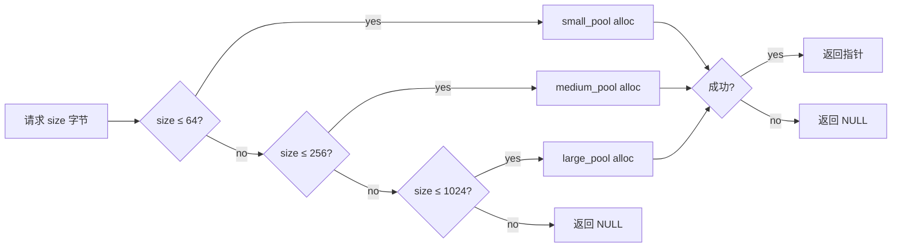

# Memory 子系统

XGL 的内存子系统为协议栈提供可预测的、无堆的内存管理能力。所有内存操作通过分层的分配器抽象完成,从底层的 allocator 接口到上层的 tiered pool 和 packet pool,每一层解决不同粒度的分配需求。

## 设计目标

- **零堆依赖**:严格 no-heap profile 下所有内存预分配,不调用 malloc/free。
- **可预测延迟**:固定块大小的 mempool 保证 O(1) 分配和释放。
- **可追踪**:tracking allocator 记录每个阶段的分配统计,便于资源预算。
- **可移植**:用户可以注入自定义 allocator,或使用内置的 malloc wrapper。

## 分配层次结构

```text
xgl_alloc() / xgl_free() ← 统一入口
    ↓
xgl_allocator_t (用户提供的 malloc/free 函数指针)
    ↓ (或 NULL → XGL_ALLOW_FALLBACK_MALLOC 控制)
xgl_tracking_allocator_t (5 阶段分配统计包装)
    ↓
xgl_mempool_t (固定块大小 free list)
    ↓ (或 thread-safe: xgl_mempool_ts_t)
xgl_tiered_pool_t (三级分层: ≤64 / ≤256 / ≤1024)
    ↓
xgl_packet_pool_t (packet 对象池 + 引用计数)
```

## Allocator 接口

### 基础分配器

`xgl_allocator_t` 是一个简单的函数指针对:

```text
xgl_allocator_t
├── alloc_fn  (void* (*)(size_t size, void* user_data))
└── free_fn   (void (*)(void* ptr, void* user_data))
```

- `xgl_alloc(allocator, size)`: 通过 allocator 分配内存,allocator 为 NULL 时使用默认分配器。
- `xgl_free(allocator, ptr)`: 释放内存。

### 默认分配器

`xgl_allocator_get_default()` 返回基于 malloc/free 的默认分配器。

- `XGL_ALLOW_FALLBACK_MALLOC=1`(默认): 允许回退到 malloc。
- `XGL_ALLOW_FALLBACK_MALLOC=0`: 严格 no-heap 模式,默认分配器返回 NULL。

### Tracking Allocator

`xgl_tracking_allocator_t` 包装底层 allocator,按阶段记录分配统计。

**5 个阶段:**

| 阶段 | 枚举值 | 说明 |
| --- | --- | --- |
| INIT | `XGL_ALLOCATOR_PHASE_INIT` | 实例创建和初始化 |
| TX | `XGL_ALLOCATOR_PHASE_RUNTIME_TX` | 稳态发送路径 |
| RX | `XGL_ALLOCATOR_PHASE_RUNTIME_RX` | 稳态接收路径 |
| RELIABLE | `XGL_ALLOCATOR_PHASE_RELIABLE` | 可靠重传存储 |
| FRAGMENT | `XGL_ALLOCATOR_PHASE_FRAGMENT` | 分片和重组 |

**统计信息:**

```text
xgl_allocator_stats_t
├── total_allocated   (size_t — 总分配字节)
├── total_freed       (size_t — 总释放字节)
├── current_allocated (size_t — 当前已分配字节)
├── peak_allocated    (size_t — 峰值已分配字节)
├── alloc_count       (size_t — 分配次数)
└── free_count        (size_t — 释放次数)
```

通过 `xgl_tracking_allocator_set_phase()` 切换阶段,统计自动归类到对应阶段。

## Memory Pool

### 固定块内存池

`xgl_mempool_t` 实现基于 free list 的固定块大小内存池。

```text
xgl_mempool_t
├── pool        (uint8_t* — 预分配缓冲区)
├── block_size  (size_t — 每个块的字节数)
├── block_count (size_t — 块总数)
├── free_count  (size_t — 空闲块数)
├── peak_used   (size_t — 峰值使用块数)
└── free_list   (void* — 空闲链表头)
```

**工作原理:**

1. 初始化时将预分配缓冲区切分为等大小的块。
2. 每个空闲块的前 `sizeof(void*)` 字节用作指针,形成单向链表。
3. 分配:从链表头取出一个块,O(1)。
4. 释放:将块插回链表头,O(1)。

**API:**

| 函数 | 说明 |
| --- | --- |
| `xgl_mempool_init()` | 初始化内存池,需要预分配缓冲区 |
| `xgl_mempool_alloc()` | 分配一个块,池满时返回 NULL |
| `xgl_mempool_free()` | 释放一个块回池 |
| `xgl_mempool_get_free_count()` | 查询空闲块数 |
| `xgl_mempool_get_used_count()` | 查询已用块数 |
| `xgl_mempool_get_peak_used()` | 查询峰值使用量 |
| `xgl_mempool_is_full()` | 检查池是否已满 |
| `xgl_mempool_is_empty()` | 检查池是否全空 |

### Thread-Safe 内存池

当 `XGL_THREAD_SAFE` 启用时,`xgl_mempool_ts_t` 在 mempool 外层包裹一个 mutex。

```text
xgl_mempool_ts_t
├── pool  (xgl_mempool_t — 底层内存池)
└── mutex (xgl_mutex_t — 互斥锁)
```

所有操作先获取锁,再委托给底层 mempool,最后释放锁。适用于多线程环境下的共享池。

## Tiered Pool

`xgl_tiered_pool_t` 将内存按大小分为三级,每级使用独立的 mempool。

```text
xgl_tiered_pool_t
├── small_pool  (mempool — 块大小 ≤ 64 字节)
├── medium_pool (mempool — 块大小 ≤ 256 字节)
├── large_pool  (mempool — 块大小 ≤ 1024 字节)
├── small_buffer / medium_buffer / large_buffer (uint8_t*)
├── small_count / medium_count / large_count (size_t)
└── owns_buffers (bool — 缓冲区是否由内部分配)
```

### 分配策略



### 两种初始化模式

1. **动态模式** (`xgl_tiered_pool_init`): 内部通过 allocator 分配缓冲区,设置 `owns_buffers=true`。
2. **静态模式** (`xgl_tiered_pool_init_static`): 用户提供预分配缓冲区,适用于 no-heap 场景,设置 `owns_buffers=false`。

### 释放策略

`xgl_tiered_pool_free(pool, ptr, size)` 根据 `size` 参数判断释放到哪个子池:

- `size ≤ 64`: 释放到 small_pool
- `size ≤ 256`: 释放到 medium_pool
- `size ≤ 1024`: 释放到 large_pool

!!! warning "释放时必须传入原始分配大小"
    tiered pool 依赖 `size` 参数确定释放目标。如果传入错误的 size,会导致释放到错误的池,造成内存损坏。

## Packet Pool

`xgl_packet_pool_t` 管理 `xgl_packet_t` 对象的预分配池,用于协议栈内部的 packet 分配。

```text
xgl_packet_pool_t
├── packets     (xgl_packet_t* — 预分配 packet 数组)
├── free_list   (xgl_list_t — 可用 packet 链表)
├── total_count (size_t — 总 packet 数)
├── free_count  (size_t — 空闲 packet 数)
├── peak_used   (size_t — 峰值使用量)
└── allocator   (xgl_allocator_t*)
```

### Packet 结构

`xgl_packet_t` 包含协议栈各层需要的所有元数据:

| 字段组 | 关键字段 | 说明 |
| --- | --- | --- |
| 寻址 | `source_id`, `target_id`, `connection_id`, `session_epoch`, `packet_number` | 定位 peer 和 session |
| 属性 | `version`, `packet_type`, `flags`, `data_type`, `reliable`, `fragment` | 帧控制信息 |
| 数据 | `data` (xgl_packet_data_t*), `extensions` | 载荷和 TLV 扩展 |
| 重传 | `retry_count`, `wait_time_ms`, `send_timestamp` | 可靠传输状态 |
| 路由 | `phy` (xgl_phy_ops_t*) | 物理层操作接口 |
| 链接 | `node` (xgl_list_node_t) | 侵入式链表节点 |

### 引用计数

`xgl_packet_data_t` 通过引用计数管理载荷数据的生命周期:

- `xgl_packet_data_ref(data)`: 引用计数 +1。
- `xgl_packet_data_unref(data, allocator)`: 引用计数 -1,归零时释放缓冲区。
- `xgl_packet_data_create(data, len, allocator)`: 创建带引用计数的数据副本。

引用计数允许多个 packet 共享同一份载荷数据(例如可靠重传),避免不必要的内存拷贝。

## 内存预算指南

### No-Heap Profile

严格 no-heap 构建要求所有内存在初始化阶段预分配:

1. **TX Pool**: `TX_POOL_SIZE` 字节,用于发送路径。
2. **RX Buffer**: `RX_BUFFER_SIZE` 字节,用于接收路径。
3. **Route Table**: `route_count × sizeof(xgl_route_item_t)` 字节。
4. **Reliable Queue**: `window_size × sizeof(xgl_reliable_packet_t)` 字节。
5. **Fragment Manager**: `max_reassembly_buffers × sizeof(xgl_reassembly_buffer_t)` 字节。

### 资源预设

参见 [配置预设](../reference/config-presets.md) 获取 5 种预设的具体资源值。

## 证据

| 规则 | 源码 | 测试 |
| --- | --- | --- |
| Mempool init/alloc/free | `src/memory/xgl_mempool.c` | `test/test_mempool.cpp` |
| Tiered pool 三级分配 | `src/memory/xgl_tiered_pool.c` | `test/test_tiered_pool.cpp` |
| Packet pool + refcount | `src/memory/xgl_packet_pool.c` | `test/test_packet_pool.cpp` |
| Tracking allocator 5 阶段 | `src/memory/xgl_tracking_allocator.c` | `test/test_allocator.cpp` |
| Thread-safe mempool | `src/memory/xgl_mempool_ts.c` | `test/test_mempool.cpp` |
| Default allocator fallback | `src/memory/xgl_allocator.c` | `test/test_allocator.cpp` |