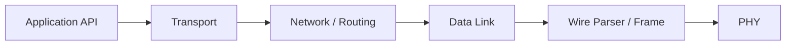

# 协议概览

XGL v2 放弃 v1 小型 packed header 思路，使用固定基础头、TLV 扩展和认证 trailer。目标是在 MCU 资源约束下提供清晰、可验证、可路由的可靠通信。

## 分层职责

| 层 | 职责 |
| --- | --- |
| API | 生命周期、发送、统计、运行时 deadline |
| Transport | reliable queue、ACK/SACK、RTT、fragment |
| Network | 16-bit 节点、route lookup、TTL、forwarding |
| Datalink/Wire | header 编解码、parser、CRC、认证 trailer |
| Platform | allocator、time、mutex、atomic、PHY callbacks |

## 生产原则

- 所有 wire 字段显式按 little-endian 编解码。
- 认证失败、CRC 失败、长度越界都 fail closed。
- 可变路由字段和端到端安全边界必须清晰分离。
- 嵌入式 profile 必须能说明内存、deadline 和 ISR 边界。

## 如何读完整协议

- 先读 [架构设计](architecture.md)，理解模块边界和 TX/RX 数据流。
- 再读 [实现映射](implementation-map.md)，把协议规则对应到源码文件和测试。
- 然后读 [状态机](state-machines.md)，理解 parser、datalink、network、transport 和 fragment 的运行状态。
- 最后按主题阅读 wire、extensions、reliability、security、routing 和 fragmentation 页面。
- 发布前用 [验证矩阵](../reference/validation-matrix.md) 和 [生产检查表](../guide/production-checklist.md) 复核。
