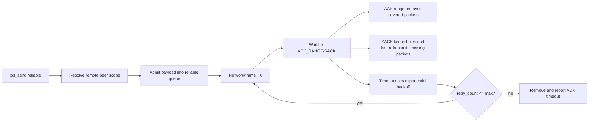
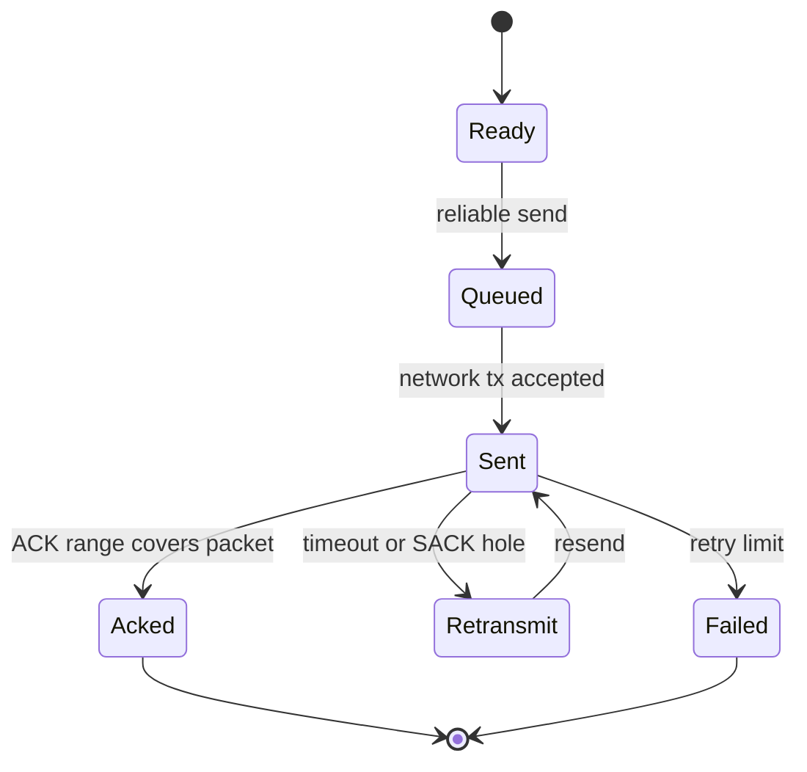

# 可靠传输

可靠性以连接级 peer state 管理，而不是 8-bit seq/ack。

## Peer Key

```text
remote_peer_id + connection_id + session_epoch
```

`remote_peer_id` 与方向有关：TX 路径使用 `target_id`，RX/ACK 路径使用收到包的
`source_id`。这与 `transport_get_or_create_peer_scope()` 和
`transport_find_peer_scope()` 的查找逻辑一致。

该 key 隔离：

- reliable queue
- sliding window
- RTT estimator
- RX next packet number
- out-of-order buffer
- replay/reassembly cleanup scope

## ACK 和 SACK

- ACK_RANGE_EXT 可以一次释放多个已发送包。
- SACK_EXT 描述缺口，保留未确认包并触发快速重传。
- ACK_RANGE_EXT 和 SACK_EXT 放在 header TLV 区，不占用 payload。
- ACK-only 包不再依赖基础头中的单字节 ack 字段。
- ACK/SACK 回复会保留收到的可靠包中的 `connection_id`、`session_epoch` 和 transport `session_id`，确保 ACK 丢失恢复仍命中同一个 peer scope。

### ACK_RANGE_EXT 字段

| 字段 | 类型 | 含义 | 源码/测试 |
| --- | --- | --- | --- |
| `largest_ack` | u32 | 该 ACK frame 描述的最高 packet number | `src/wire/xgl_wire_ack_ext.c`, `test/test_wire.cpp` |
| `ack_delay_us` | u32 | 编码后的 ACK delay 元数据；当前测试验证 encode/decode 往返 | `src/wire/xgl_wire_ack_ext.c`, `test/test_wire.cpp` |
| `range_count` | u8 | 后续 range 数量 | `src/wire/xgl_wire_ack_ext.c`, `test/test_reliable.cpp` |
| `gap` | u16 | 从前一个确认 range 向后回退的距离 | `src/transport/xgl_reliable_ack.c`, `test/test_reliable.cpp` |
| `length` | u16 | 该 range 覆盖的 packet 数量 | `src/transport/xgl_reliable_ack.c`, `test/test_reliable.cpp` |

### SACK_EXT 字段

| 字段 | 类型 | 含义 | 源码/测试 |
| --- | --- | --- | --- |
| `base_packet` | u32 | bitmap 描述的第一个 packet number | `src/wire/xgl_wire_ack_ext.c`, `test/test_wire.cpp` |
| `bitmap_len` | u8 | bitmap 字节数 | `src/wire/xgl_wire_ack_ext.c`, `test/test_wire.cpp` |
| `bitmap` | bytes | bit `n` 描述 `base_packet + n` 的接收状态 | `src/transport/xgl_transport_sack.c`, `test/test_transport.cpp` |

全零 SACK bitmap 是合法编码。它保留 `base_packet` 这个已知缺口，使发送端可以快速重传缺失包，同时移除被明确标记为已接收的包。

### Reliable 数据流



## 发送端状态



发送端 reliable queue 使用 packet number 索引桶加速查找。窗口较小时链表仍可遍历，但 ACK/SACK 主路径不应退化为全队列线性搜索。

可靠发送是事务式的：先进入 reliable queue，再交给 network layer。入队失败时不得发送；network 发送失败时移除队列记录；packet number 和窗口状态只在 network 接受发送后提交。

## 接收端状态

| 条件 | 行为 |
| --- | --- |
| `packet_number == rx_next_packet_number` | 交付并推进连续窗口 |
| `packet_number > rx_next_packet_number` | 缓存到 out-of-order buffer，发送 ACK/SACK |
| `packet_number < rx_next_packet_number` | 视为重复或旧包，不重复交付 |
| connection/session 不匹配 | 拒绝，不污染其他 peer state |

## 有序交付

接收端按 packet number 缓存乱序包。只有从 `rx_next_packet_number` 开始连续的 payload 才交付给应用 callback。

## Reset / Close

RESET 和 CLOSE 只清理对应 peer、connection 和 session，不全局清 ACK、fragment 或 replay 状态。

## 可观测性

可靠路径应通过统计暴露重传、ACK timeout、窗口满和丢弃情况。生产调试时优先看 route MTU、auth/replay 拒绝和 reliable queue 使用峰值。

## RTT 估算算法

Transport 层的 RTT 估算基于 RFC 6298，通过 `xgl_rtt_estimator_t` 实现。

### 算法参数

| 参数 | 说明 |
| --- | --- |
| SRTT | 平滑往返时间，指数移动平均 |
| RTTVAR | RTT 变化量估计 |
| RTO | 重传超时 = SRTT + 4 × RTTVAR |

### 更新规则

1. 首次采样：`SRTT = RTT_sample`, `RTTVAR = RTT_sample / 2`
2. 后续采样：`RTTVAR = (1 - β) × RTTVAR + β × |SRTT - RTT_sample|`, `SRTT = (1 - α) × SRTT + α × RTT_sample`（α = 1/8, β = 1/4）
3. RTO 取值范围有最小/最大边界钳制
4. 超时重传时不更新 SRTT/RTTVAR（仅在收到新 ACK 时更新）

### 证据

`src/transport/xgl_rtt.c`, `include/xgl/internal/xgl_rtt.h`

## 滑动窗口机制

`xgl_sliding_window_t` 控制未确认 packet 的在途数量。

### 结构

| 字段 | 说明 |
| --- | --- |
| `window_size` | 窗口大小（可配置） |
| `base` | 窗口基序号（已确认的最小序号） |
| `is_used[window_size]` | bitmap 标记哪些槽位被占用 |

### 工作流程

**发送端：**

1. 发送新 packet 时，检查窗口是否有空闲槽位
2. 有空闲：分配槽位，标记 `is_used[序号 % window_size] = true`
3. 无空闲：等待 ACK 释放槽位
4. 收到 ACK range：释放范围内所有槽位，推进 base

**接收端：**

1. 收到 packet：检查 `packet_number` 相对于 `rx_next_packet_number` 的位置
2. 等于期望值：交付并推进窗口
3. 大于期望值：缓存乱序包
4. 小于期望值：视为重复，丢弃

### 与 Reliable Queue 的关系

- Reliable Queue 管理待 ACK 的 packet（32-bucket hash index 加速查找）
- Sliding Window 管理在途数量上限
- 两者协同实现流量控制和可靠交付

### 证据

`src/transport/xgl_window.c`, `include/xgl/internal/xgl_window.h`, `include/xgl/internal/xgl_transport.h`
