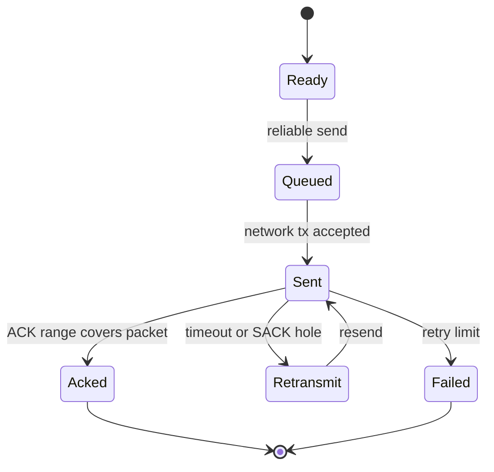

# 可靠传输

可靠性以连接级 peer state 管理，而不是 8-bit seq/ack。

## Peer Key

```text
target_id + connection_id + session_epoch
```

该 key 隔离：

- reliable queue
- sliding window
- RTT estimator
- RX next packet number
- out-of-order buffer
- replay/reassembly cleanup scope

## ACK 和 SACK

- ACK_RANGE_EXT 可以一次释放多个已发送包。
- SACK_EXT 描述缺口，保留未确认包并触发快速重传。
- ACK_RANGE_EXT 和 SACK_EXT 放在 header TLV 区，不占用 payload。
- ACK-only 包不再依赖基础头中的单字节 ack 字段。

## 发送端状态



发送端 reliable queue 使用 packet number 索引桶加速查找。窗口较小时链表仍可遍历，但 ACK/SACK 主路径不应退化为全队列线性搜索。

## 接收端状态

| 条件 | 行为 |
| --- | --- |
| `packet_number == rx_next_packet_number` | 交付并推进连续窗口 |
| `packet_number > rx_next_packet_number` | 缓存到 out-of-order buffer，发送 ACK/SACK |
| `packet_number < rx_next_packet_number` | 视为重复或旧包，不重复交付 |
| connection/session 不匹配 | 拒绝，不污染其他 peer state |

## 有序交付

接收端按 packet number 缓存乱序包。只有从 `rx_next_packet_number` 开始连续的 payload 才交付给应用 callback。

## Reset / Close

RESET 和 CLOSE 只清理对应 peer、connection 和 session，不全局清 ACK、fragment 或 replay 状态。

## 可观测性

可靠路径应通过统计暴露重传、ACK timeout、窗口满和丢弃情况。生产调试时优先看 route MTU、auth/replay 拒绝和 reliable queue 使用峰值。
