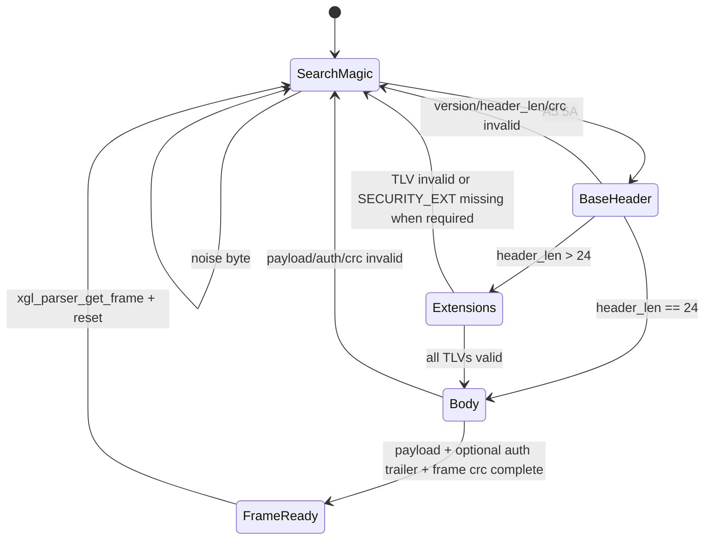
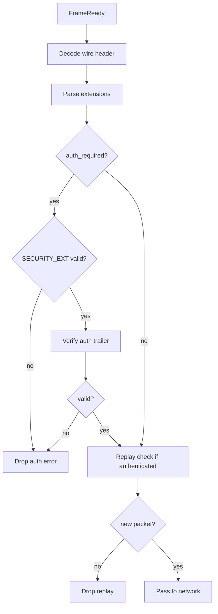
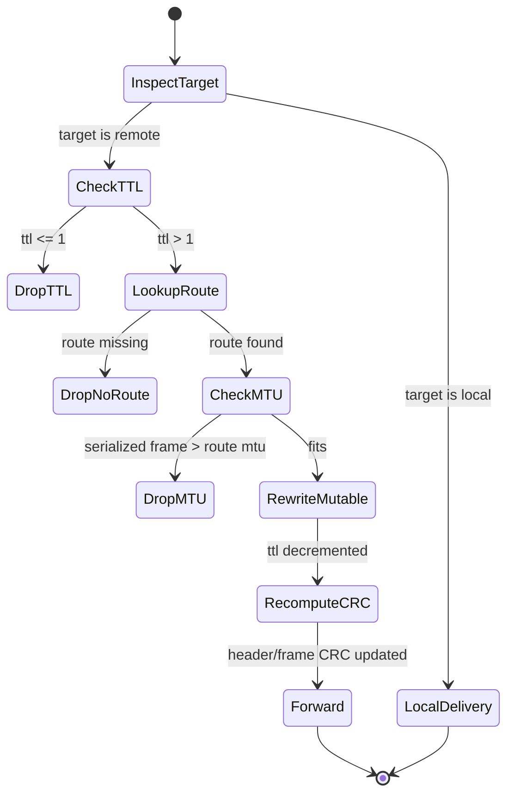
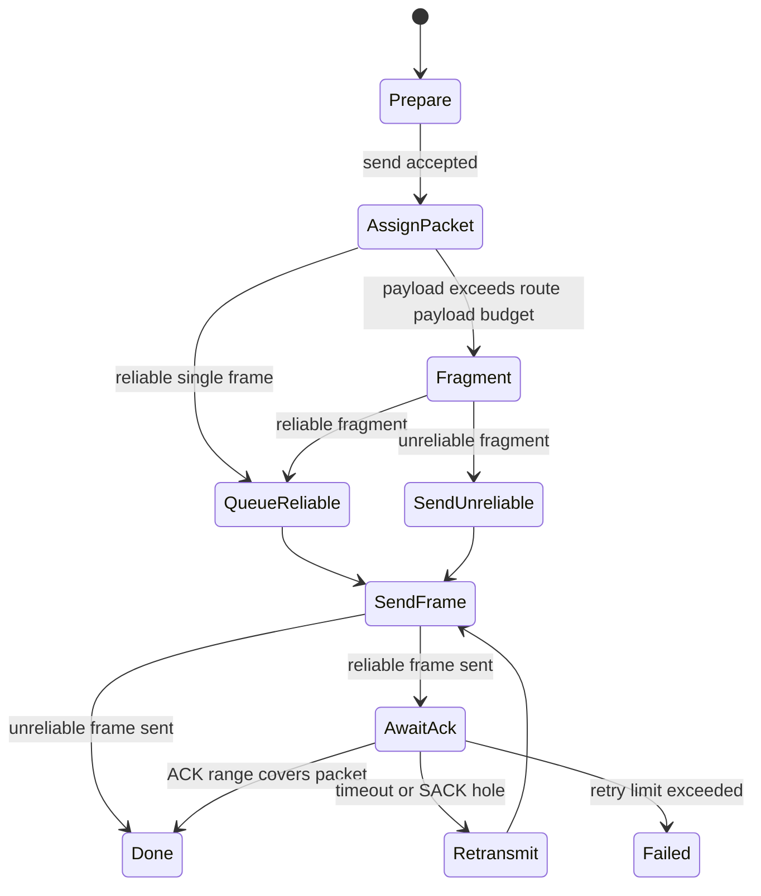
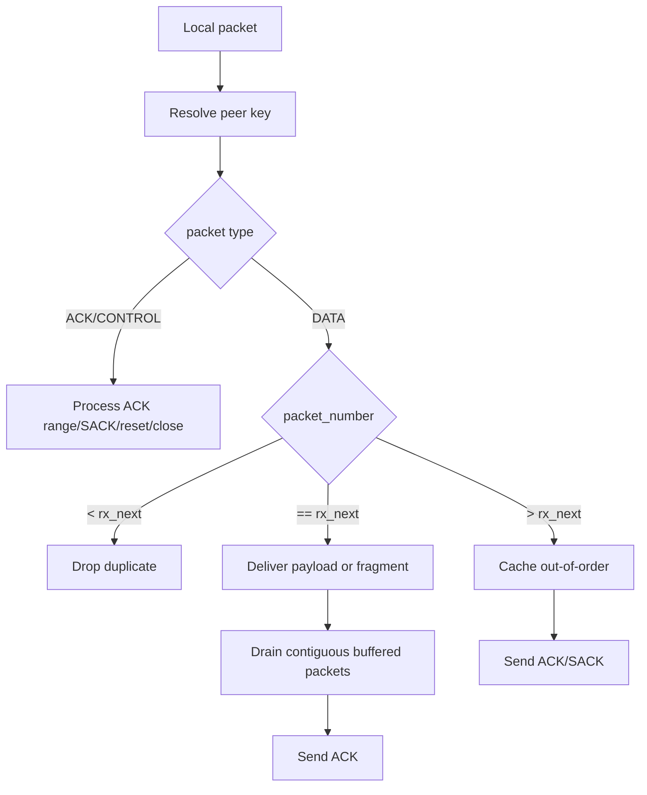
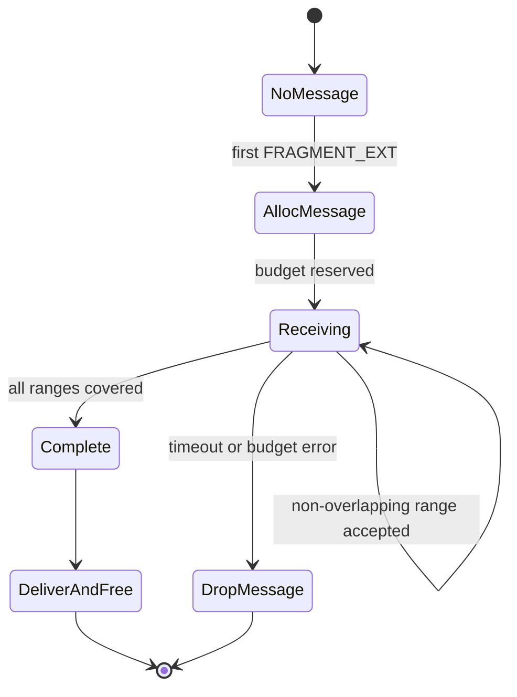

# 协议状态机

本页描述 XGL v2 的关键状态机。状态机是实现、测试和问题定位的共同语言。

## Parser 状态机



实现要求：

- `SearchMagic` 必须支持噪声和重叠 magic。
- `BaseHeader` 只读取 24-byte base header，不提前信任 payload。
- `Extensions` 按 TLV cursor 遍历，任何越界都 reset。
- `Body` 的长度必须由 `payload_len + auth_tag_len + frame_crc16` 推导。

### Parser 状态表

| 状态 | 进入条件 | 完成条件 | 错误/超时行为 | 证据 |
| --- | --- | --- | --- | --- |
| `XGL_PARSE_MAGIC` | parser reset 或坏帧被丢弃 | 找到 `A5 5A` | 忽略噪声；保留重叠 magic | `src/wire/xgl_parser.c`, `test/test_parser.cpp` |
| `XGL_PARSE_HEADER` | 第一个 magic byte 已缓存 | 24-byte 基础头 decode 成功 | magic/version/header CRC 错误时 reset 到 MAGIC | `src/wire/xgl_parser.c`, `src/wire/xgl_wire.c`, `test/test_parser.cpp` |
| `XGL_PARSE_PAYLOAD` | header/TLV 合法且 body 长度非零 | 缓存 `payload_len + auth_tag_len` 字节 | cache overflow reset 到 MAGIC | `src/wire/xgl_parser.c`, `test/test_parser.cpp` |
| `XGL_PARSE_CRC` | header-only frame 或 body 字节已完整 | frame CRC 校验通过 | CRC 失败 reset 到 MAGIC | `src/wire/xgl_parser.c`, `test/test_parser.cpp` |

`xgl_parser_check_timeout()` 只会让非 MAGIC 状态过期。超时会把 parser reset 到
MAGIC，并清空 cached length、expected payload length 和 expected authentication tag length。

## Datalink 验证状态机



认证失败、被拒绝的 replay 和 key mismatch 都不得 ACK，也不得进入 transport。ACK-eliciting 的可靠重复包是 replay 例外：它只能进入 transport 用于重新生成 ACK/SACK，不得再次交付。

## Network 转发状态机



TTL 是 mutable header 字段。转发必须重算 header CRC 和 frame CRC，但必须保留端到端认证 tag。认证帧仍能被下一跳验证，因为 TTL 和 header CRC 在端到端 AAD 中会被规范化排除。

## Transport 发送状态机



关键约束：

- packet number 对每个 peer key 单调递增。
- reliable 包在 ACK 覆盖前不能释放 payload 副本。
- retry limit 触发后只影响对应 peer/connection/session。

## Transport 接收状态机



应用 callback 只接收按序、完整、通过认证和重组预算的 payload。

## Fragment Reassembly 状态机



重组 key：

```text
source_id + connection_id + session_epoch + message_id
```

该 key 防止不同节点、连接或 session 的相同 `message_id` 混淆。

## RESET/CLOSE 作用域

RESET 和 CLOSE 必须只清理对应 scope：

```text
target/source node + connection_id + session_epoch
```

不得全局清空 route table、其他 peer 的 reliable queue、其他 session 的 replay window 或 fragment reassembly。

## Parser 超时行为

Parser 状态机在帧接收过程中设有超时保护。

### 超时参数

| 常量 | 默认值 | 说明 |
| --- | --- | --- |
| `XGL_PARSER_TIMEOUT_MS` | 1000 | parser 单帧接收超时 (ms) |

### 超时触发条件

- parser 已找到 magic 并开始解析，但在 `XGL_PARSER_TIMEOUT_MS` 内未完成完整帧接收
- 连续字节流中长时间未出现下一个 magic

### 超时行为

1. 丢弃已接收的不完整帧数据
2. 重置 parser 状态机到 `SearchMagic` 状态
3. 计数器递增
4. 继续从下一字节开始搜索 magic

### 认证 tag 长度

Parser 维护 `expected_auth_tag_len` 字段，用于在 `AUTHENTICATED` flag 设置时正确定位 auth trailer 和 frame CRC 的边界。

### 证据

`include/xgl/internal/xgl_parser.h`, `src/wire/xgl_parser.c`
