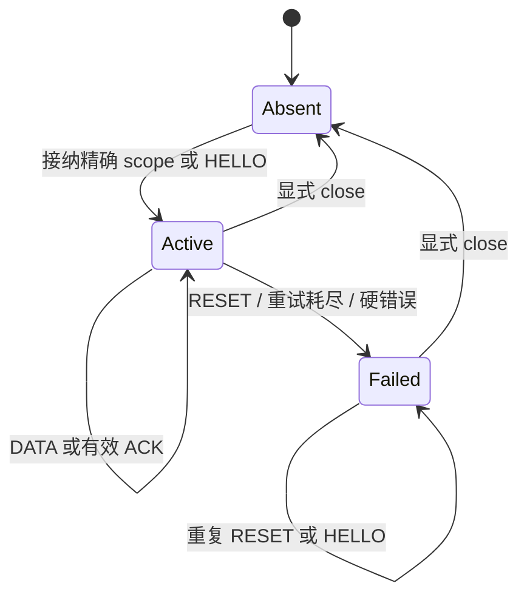
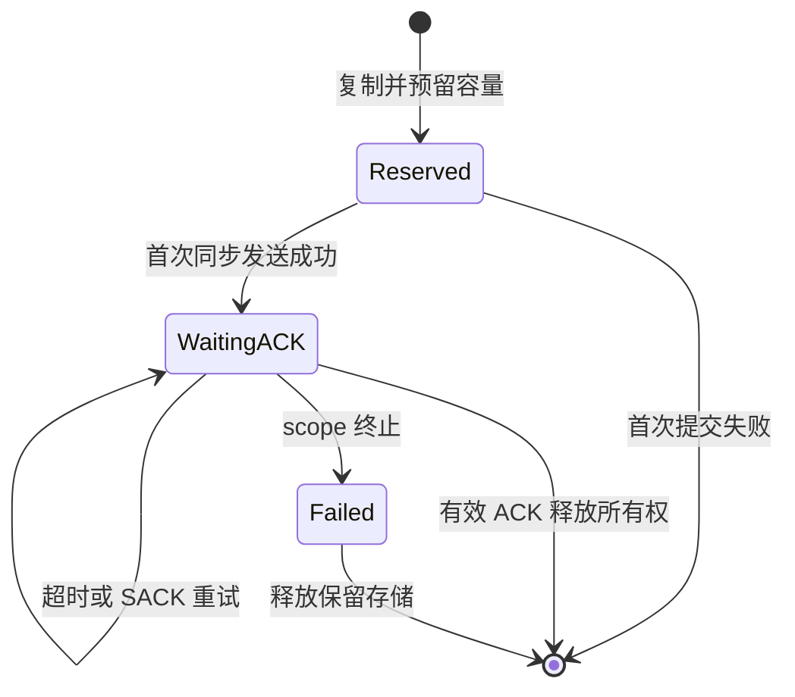

# 状态机

状态转换属于精确 scope。应用意图、可靠 DATA 编号与认证重放状态具有各自独立的生命周期。

## Peer 生命周期

```mermaid
stateDiagram-v2
    [*] --> Absent
    Absent --> Active: 接纳精确 scope 或 HELLO
    Active --> Active: DATA 或有效 ACK
    Active --> Failed: RESET / 重试耗尽 / 硬错误
    Failed --> Failed: 重复 RESET 或 HELLO
    Active --> Absent: 显式 close
    Failed --> Absent: 显式 close
```

失败 epoch 是终态。Close 释放 transport 容量，新的连接尝试必须使用新 epoch。关闭仍有已接纳工作的 scope 时报告一次取消。RESET 只查找已存在的精确 scope，不创建或重新开放它。HELLO 幂等，不重置计数器。

空闲回收仅适用于空 peer：它从未消耗 TX 可靠编号，也没有 RX 可靠编号状态。任一方向存在可靠历史后，空闲时间不能清除去重保护或重启编号。该 scope 保留至显式 close，超时查询也不再包含其空闲定时器。

## 可靠包生命周期

```mermaid
stateDiagram-v2
    [*] --> Reserved: 复制并预留容量
    Reserved --> WaitingACK: 首次同步发送成功
    Reserved --> [*]: 首次提交失败
    WaitingACK --> WaitingACK: 超时或 SACK 重试
    WaitingACK --> [*]: 有效 ACK 释放所有权
    WaitingACK --> Failed: scope 终止
    Failed --> [*]: 释放保留存储
```

已接纳的分片消息还持有未发送尾部。窗口耗尽时暂停推进，ACK 或后续 step 继续推进。应用 BUSY 可以使已接纳接收包或完整消息继续保留。临时背压不允许丢弃已确认字节。

## 安全生命周期

显式安装建立可信方向性关联。签名尝试即使 provider 失败也消耗预留的安全序号。验签成功才提交重放窗口更新，验签失败不提交。Transport RESET 不改变这些状态。

Security close 停用关联并保留关闭标记。安装时立即预留方向性 `(key_id, nonce_prefix)` 域。同一上下文不能重新安装相同 scope，也不能复用已预留的域；应用负责防止不同 ID 对应同一实际密钥的别名复用。因此安全会话槽也计入关闭标记。设备重启后必须重新建立信任或使用持久化新鲜性状态，RAM 清零不等于经过认证的新 epoch。
