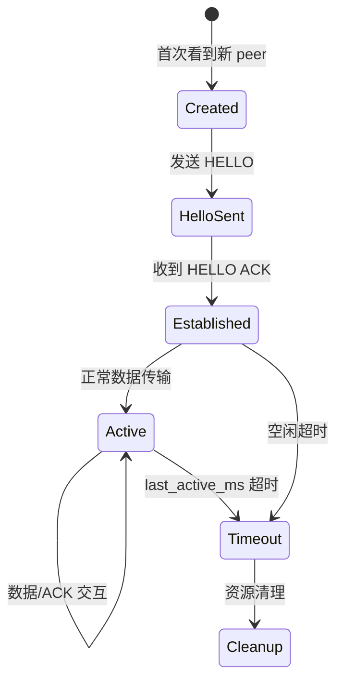

# Transport 内部设计

Transport 层是 XGL 协议栈中最复杂的层,包含 28 个源文件。本文档详细说明每个子模块的职责、数据结构和交互关系。

## 模块总览

Transport 层按功能分为 6 个子模块:

```text
src/transport/
├── 发送路径 (5 文件)
│   ├── transport.c                 — 初始化/销毁
│   ├── transport_send.c            — 发送总入口
│   ├── transport_send_plan.c       — 单帧 vs 分片决策
│   ├── transport_send_packet.c     — 单包发送
│   └── transport_send_fragment.c   — 分片发送
├── 接收路径 (5 文件)
│   ├── transport_receive.c         — 接收总入口
│   ├── transport_receive_ack.c     — ACK 接收处理
│   ├── transport_receive_peer.c    — peer scope 解析
│   ├── transport_receive_order.c   — 有序接收
│   └── transport_delivery.c        — 递交给应用 callback
├── 可靠性 (4 文件)
│   ├── reliable.c                  — reliable queue 管理
│   ├── reliable_packet.c           — packet 对象管理
│   ├── reliable_ack.c              — ACK range 处理
│   └── reliable_timeout.c          — 超时处理
├── ACK/SACK (4 文件)
│   ├── transport_ack.c             — ACK 生成
│   ├── transport_ack_send.c        — ACK 发送
│   ├── transport_sack.c            — SACK 生成
│   └── transport_sack_send.c       — SACK 发送
├── 分片 (5 文件)
│   ├── fragment.c                  — 分片核心
│   ├── fragment_range.c            — range 合并
│   ├── fragment_reassembly.c       — 重组 buffer 管理
│   ├── fragment_maintenance.c      — 超时维护
│   └── fragment_process.c          — fragment 处理入口
└── 控制/运行时 (5 文件)
    ├── transport_control.c         — HELLO/RESET 处理
    ├── transport_retransmit.c      — 重传逻辑
    ├── transport_runtime.c         — 运行时调度
    ├── transport_interface.c       — layer interface 适配
    └── transport_memory.c          — 内存分配策略
```

## Peer State 设计

每个远端节点维护独立的 transport peer state:

```text
xgl_transport_peer_state_t
├── peer_id              (uint16_t — 远端节点 ID)
├── has_connection_scope (bool — 是否按 connection 绑定)
├── connection_id        (uint32_t — 连接 ID)
├── session_epoch        (uint32_t — 会话纪元)
├── session_id           (uint16_t — transport session ID)
├── hello_sent           (bool — HELLO 是否已发送)
├── session_established  (bool — peer session 是否已知)
├── tx_window            (xgl_sliding_window_t — 发送窗口)
├── reliable_queue       (xgl_reliable_queue_t — 可靠队列)
├── rtt_est              (xgl_rtt_estimator_t — RTT 估计器)
├── last_active_ms       (uint32_t — 最后活跃时间戳)
├── rx_next_packet_number(uint32_t — 期望的下一个包号)
├── rx_has_packet_number_state (bool — 接收序号状态是否初始化)
├── rx_buffered          (链表 — 乱序缓存包)
├── rx_buffered_count    (uint8_t — 乱序缓存数量)
└── next                 (链表节点 — peer 链表)
```

### Peer 三元组

Peer state 通过 `(peer_id, connection_id, session_epoch)` 三元组唯一标识:

- `peer_id`: TX 路径用 `target_id`,RX/ACK 路径用收到包的 `source_id`。
- `connection_id`: 生产连接上下文 ID。
- `session_epoch`: 生产会话纪元。

该三元组隔离: reliable queue、sliding window、RTT estimator、RX buffer 和 replay/reassembly cleanup scope。

### Peer 生命周期



## 发送路径

### 调用链

```text
xgl_send()
  → xgl_transport_send()
    → xgl_transport_send_plan.c (单帧 vs 分片决策)
      → 单帧: xgl_transport_send_packet.c
      → 分片: xgl_transport_send_fragment.c
        → reliable_queue 入队
        → xgl_layer_send() → network → datalink → PHY
```

### 发送决策

1. **检查窗口**: `xgl_window_can_send()` 确认滑动窗口有空闲槽位。
2. **检查分片**: payload 大小是否超过 route MTU。
   - 未超过: 单包发送。
   - 超过且分片启用: 分片发送。
   - 超过且分片禁用: 返回 `XGL_ERR_BUFFER_TOO_SMALL`。
3. **可靠发送**: 入队到 `reliable_queue`,保留数据副本。
4. **不可靠发送**: 直接交给 network 层,不入队。

### 事务式可靠发送

可靠发送遵循严格的事务语义:

1. 先入队到 reliable queue。
2. 再交给 network layer。
3. 入队失败时不发送。
4. network 发送失败时移除队列记录。
5. packet number 和窗口状态只在 network 接受发送后提交。

## 接收路径

### 调用链

```text
PHY rx callback → xgl_run()
  → xgl_datalink_receive()
    → xgl_parser → auth verify → replay check
    → xgl_layer_receive() → network
      → xgl_network_receive()
        → local: xgl_layer_receive() → transport
          → xgl_transport_receive()
            → transport_receive_peer.c (peer scope 解析)
            → ACK/CONTROL: transport_receive_ack.c
            → DATA: transport_receive_order.c
              → 有序交付: transport_delivery.c → rx_callback
              → 乱序: 缓存到 rx_buffered
        → remote: forward (TTL--, CRC rewrite)
```

### 接收端状态表

| 条件 | 行为 |
| --- | --- |
| `packet_number == rx_next_packet_number` | 交付并推进连续窗口 |
| `packet_number > rx_next_packet_number` | 缓存到乱序 buffer,发送 ACK/SACK |
| `packet_number < rx_next_packet_number` | 视为重复或旧包,不重复交付 |
| connection/session 不匹配 | 拒绝,不污染其他 peer state |

### 有序交付

接收端按 packet number 缓存乱序包。只有从 `rx_next_packet_number` 开始连续的 payload 才交付给应用 callback。乱序包缓存在 `rx_buffered` 链表中,等待缺失包到达后一起交付。

## Reliable Queue

### 数据结构

```text
xgl_reliable_queue_t
├── wait_ack_list          (xgl_list_t — 待 ACK 包链表)
├── index_buckets[32]      (xgl_reliable_packet_t* — hash 索引桶)
├── max_retry_count        (uint8_t — 最大重试次数)
└── allocator              (xgl_allocator_t*)
```

### Reliable Packet

```text
xgl_reliable_packet_t
├── data / data_len        (uint8_t* / size_t — 包数据副本)
├── source_id / target_id  (uint16_t — 寻址)
├── packet_number          (uint32_t — 包序号)
├── session_id / connection_id / session_epoch
├── retry_count            (uint8_t — 当前重试次数)
├── send_timestamp         (uint32_t — 发送时间戳)
├── timeout_ms             (int32_t — 当前超时值)
├── initial_timeout_ms     (int32_t — 初始超时值)
└── phy                    (xgl_phy_ops_t* — 物理层)
```

### 32-Bucket Hash Index

Reliable queue 使用 32 个桶的 hash table 加速包查找:

- 查找: `packet_number % 32` 定位桶,桶内链表遍历。
- ACK/SACK 处理时需要快速找到对应包。
- 窗口较小时链表短,查找高效。

### 超时重传

1. `xgl_reliable_process_timeouts()` 遍历 wait_ack_list。
2. 对每个包检查 `current_time_ms - send_timestamp >= timeout_ms`。
3. 超时包: 重传 + `retry_count++` + 指数退避。
4. `retry_count > max_retry_count`: 标记为 retry exhausted,报告 error_callback。

### 指数退避

```text
backoff = initial_timeout_ms × 2^retry_count
```

退避范围由 `XGL_MIN_RTO_MS`(100ms) 到 `XGL_MAX_RTO_MS`(5000ms) 钳制。

## ACK/SACK 生成

### ACK 生成时机

- 收到可靠数据包后,发送 ACK 确认。
- ACK 携带 `largest_ack` 和可选的 ACK ranges。

### SACK 生成时机

- 检测到乱序包(缺口)时,发送 SACK 描述已收到的包。
- SACK 触发发送端快速重传缺失包。

### ACK/SACK 保留字段

ACK/SACK 回复会保留收到的可靠包中的 `connection_id`、`session_epoch` 和 `session_id`,确保 ACK 丢失恢复仍命中同一个 peer scope。

## 分片管理

### 分片决策

```text
payload_size <= route_MTU → 单包发送
payload_size > route_MTU  → 分片发送 (如果 enable_fragmentation=true)
```

### 重组 Buffer

```text
xgl_reassembly_buffer_t
├── source_id / connection_id / session_epoch / data_type / message_id
├── received_bytes          (size_t — 已收到的唯一字节数)
├── received_ranges[16]     (xgl_fragment_received_range_t — 范围数组)
├── received_range_count    (size_t — 活跃范围数)
├── data                    (uint8_t* — 重组数据缓冲区)
├── data_len                (size_t — 完整消息长度)
├── first_fragment_time     (uint32_t — 首个分片时间戳)
└── timeout_ms              (uint32_t — 重组超时)
```

### Range 合并策略

重组使用 16 个 range 描述已收到的字节范围(而非逐字节 bitmap):

1. 新分片到达: 找到与 `[offset, offset+len)` 重叠或相邻的 range。
2. 合并: 扩展已有 range 或创建新 range。
3. 当 `received_ranges` 溢出 16 个时,拒绝新分片。
4. 当 `received_bytes == data_len` 时,重组完成。

### 超时清理

- 默认超时: `XGL_FRAGMENT_TIMEOUT_MS = 5000` ms
- 超时后释放重组 buffer,避免内存泄漏。
- Scope 清理: RESET/CLOSE 时清理对应 `(source_id, connection_id, session_epoch)` 的所有重组 buffer。

## Control 消息

| 控制类型 | DATA_TYPE 值 | 用途 |
| --- | --- | --- |
| HELLO | `0x0E` | 建立 peer session |
| RESET | `0x0F` | 重置特定 peer/connection |

HELLO 和 RESET 只清理对应 peer、connection 和 session,不全局清 ACK、fragment 或 replay 状态。

## 运行时调度

`xgl_transport_run()` 由 `xgl_run()` 周期性调用(建议 10-100ms 间隔):

1. 遍历所有 peer state。
2. 处理超时重传(`reliable_process_timeouts`)。
3. 处理分片重组超时(`fragment_process_timeouts`)。
4. 清理不活跃的 peer state。

## 证据

| 模块 | 源码 | 测试 |
| --- | --- | --- |
| Transport init/send/receive | `src/transport/transport.c`, `transport_send.c`, `transport_receive.c` | `test/test_transport.cpp` |
| Reliable queue + timeout | `src/transport/reliable.c`, `reliable_timeout.c` | `test/test_reliable.cpp` |
| ACK/SACK | `src/transport/transport_ack.c`, `transport_sack.c` | `test/test_transport.cpp` |
| Fragment/reassembly | `src/transport/fragment.c`, `fragment_reassembly.c` | `test/test_fragment.cpp` |
| Sliding window | `src/transport/xgl_window.c` | `test/test_window.cpp` |
| RTT estimator | `src/transport/xgl_rtt.c` | `test/test_rtt.cpp` |
| Peer state | `src/transport/transport_peer.c` | `test/test_transport.cpp` |